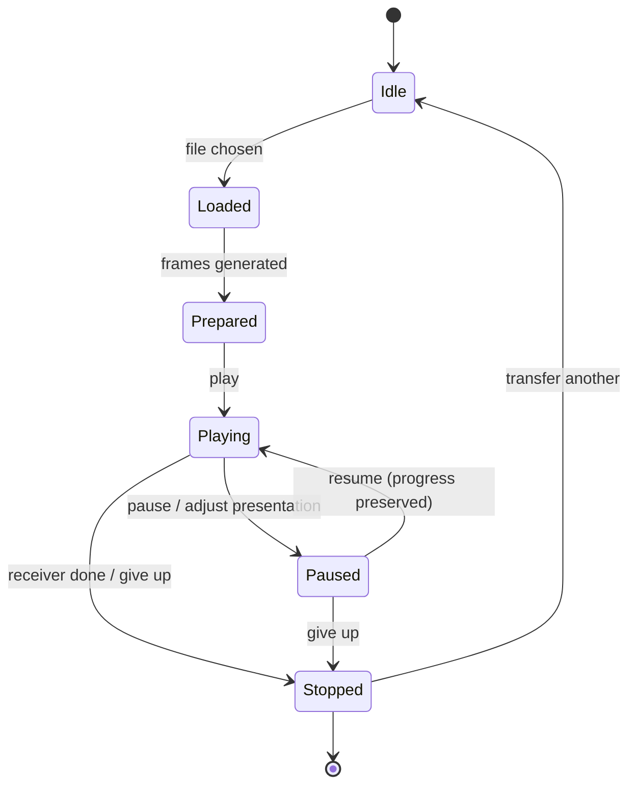
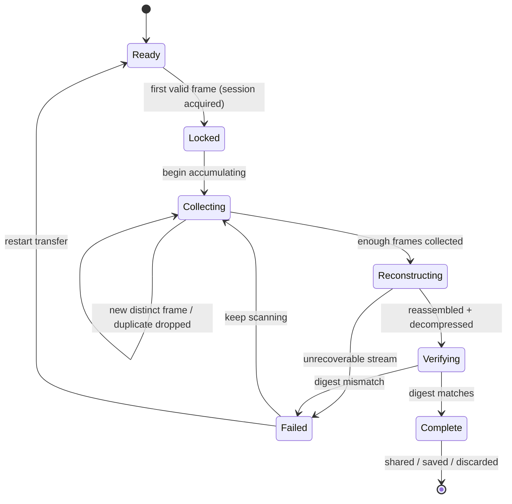

# Blink-Drop — Product Blueprint

| | |
|---|---|
| **Status** | Draft v0.5 — receiver pivoted to PWA |
| **Date** | 2026-07-07 |
| **Scope** | Technology-neutral product definition: what the system does, the workflows and progress model of the two sides, and the constraints imposed by the relevant standards. No library, language, framework, or algorithm commitments — those are decided in the architecture documents and the protocol specification (`docs/01-protocol.md`). |
| **Changes** | v0.5 — **receiver pivoted from a native iOS app to an installable PWA** (developer has no Mac; iOS native dev is macOS-only). Reconciled: Product Experience Direction receiver surface, §9 (a web receiver is now the product, not an excluded throwaway), §11 S7 wording, and a new Risk 8. Full technical delta in `docs/blink-drop-architecture-update.md`; the native iOS app is deferred (its `docs/ios/*` become the future-native reference).<br>v0.4 — added **Product Experience Direction** and **Recommended Next Stages** sections so the `architecture` and `ux-design` skills consume this blueprint cleanly (hybrid design-pipeline adoption). Content consolidated from existing §2/§6/§12/§13; no decisions changed.<br>v0.3 — applied `00-blueprint-review.md`: disambiguated presentation vs. partitioning parameters (§5, §7, OQ-10); added dual-use/exfiltration posture (Risk 7) and narrowed U2's v1 confidentiality scope (§2, DEC-1); added success criteria for R-ADJUST/R-SESSION (S8/S9); reframed M0 as a delivery-path precursor (§9); added OQ dependency structure + security-review recommendation (§13); added state diagrams (§6), a Working Assumptions appendix (Appendix C), a throughput-figure explanation (§3), and headroom to S6.<br>v0.2 — workflow/progress sections expanded and grounded in prior-art review; implementation mechanisms removed from normative text; offline-sender requirement added. |

---

## 1. Vision & Problem

Moving a small file from a computer to a phone is disproportionately hard when the usual channels are unavailable or untrusted: no shared Wi-Fi, Bluetooth pairing blocked, USB ports locked down, cloud services prohibited, or the machine is deliberately air-gapped.

**Blink-Drop** transfers small files through the one channel that almost always exists: *the screen*. The sender displays the file as an animated sequence of QR codes; the receiver watches the screen through its camera, reconstructs the file, proves it arrived intact, and hands it to the user.

The transfer requires **no network, no radio, no cable, no pairing, no accounts, and no third party**. Nothing but photons crosses the gap.

## 2. Target Users & Use Cases

**Primary persona:** developers, operators, and security-conscious technical users moving controlled data between machines that must not (or cannot) share a network.

| # | Use case | Typical payload | Size class |
|---|----------|-----------------|------------|
| U1 | Config out of an air-gapped or lab machine | config file, YAML/JSON | 1–50 KB |
| U2 | Credential / key material handoff | token, keypair, wallet data | < 5 KB |
| U3 | Document off a locked-down corporate laptop | PDF, text, spreadsheet | 50 KB – 2 MB |
| U4 | Signed payload distribution | signed manifest, license blob | 1–100 KB |
| U5 | Quick text/data grab from any screen-equipped device | notes, logs, URLs | < 20 KB |

U1 has a consequence that is easy to miss: **the sending machine may itself have no internet access.** The sender must therefore be obtainable in advance and function fully offline (see §4, §9).

The persona and U1–U5 are **design hypotheses, not validated market segments** (Appendix C, A2).

**U2 confidentiality scope (v1).** v1 provides *no payload confidentiality* — the QR animation is readable by anything with line of sight or a screen recorder. Until passphrase encryption ships (v1.1, top backlog item), U2 is limited to key material that is either non-secret, already encrypted at rest (e.g. a password-protected keystore or an externally wrapped blob), or whose optical exposure the user explicitly accepts. Moving cleartext secrets over v1 is the user's explicit risk. This deferral is a recorded decision (DEC-1, §13), not a passive omission.

**Anti-use-case:** photos, video, archives, anything above a few MB. Other tools exist for connected machines; Blink-Drop is for when they can't be used.

## 3. Operating Envelope

The optical channel has hard limits, set by the QR standard and by camera physics. The product must present these limits honestly rather than fight them.

**Per-frame capacity (standard).** ISO/IEC 18004 defines QR symbol versions 1–40. At the lowest error-correction level, byte-mode capacity ranges from 271 bytes (version 10) to 2,953 bytes (version 40). The standard also defines four data modes; two matter here:

- *Byte mode* — arbitrary binary, but reader support for binary payloads is inconsistent in practice (a limitation noted independently by two of the reference systems, Appendix A).
- *Alphanumeric mode* — a 45-character set (`0–9 A–Z space $%*+-./:`); universally readable, but binary data must be re-encoded into it at a capacity cost.

Which mode (and thus which capacity budget) Blink-Drop uses is a protocol decision (`OQ-2`).

**Reliable band (observed).** Screen-to-camera decoding is only dependable in the mid-density band — roughly versions 15–25, i.e. **~500–1,300 bytes per frame**. Prior-art parameter sweeps (Appendix A) found sharp reliability cliffs past the sweet spot, and found that the *lowest* symbol error-correction level performs best in practice: smaller, coarser symbols scan more reliably, and loss protection is better provided at the stream level than inside each symbol. Planning figure: **~1 KB/frame**.

**Frame rate (observed).** Cameras sustain reliable decode at roughly 5–15 frames per second regardless of display refresh rate; prior-art sweeps found frame rate matters less than frame density. Planning figure: **10 fps**.

**Effective throughput.** ~1 KB × 10 fps, minus redundancy and metadata overhead ≈ **8–10 KB/s** steady-state goodput.

| File size | Expected transfer time |
|-----------|------------------------|
| 10 KB | ~2 s |
| 100 KB | ~15–25 s |
| 1 MB | ~2–3 min |
| 2 MB (soft ceiling — warn) | ~4–6 min |
| > 5 MB | out of scope |

The table figures are **conservative real-world estimates**, deliberately above the raw 8–10 KB/s goodput: they fold in session lock-on latency, fountain over-collection (the receiver needs slightly *more* than one file's worth of distinct frames), duplicate captures, and margin for optical variability. This puts them ~1.3–2× the raw rate, with the gap largest for small files where the fixed lock-on cost dominates and smallest for large files where steady-state streaming dominates. All figures are planning values pending the sweep harness (Appendix C, A1).

**Compression** before encoding typically shrinks text-like payloads 3–5×, materially extending the practical ceiling; already-compressed formats gain nothing.

## 4. System Concept

Two cooperating halves joined only by light:

- **Sender** — a web page running in any modern browser on any machine with a screen. Zero installation, zero backend: the file is processed entirely on the sender's machine and never leaves it over any network. The page itself must be obtainable as a self-contained artifact that works with no connectivity at all (U1). Output is an animated sequence of QR frames displayed on screen in a loop.
- **Receiver** — an installable web app (PWA) on the user's phone. It watches the animation, collects frames in any order, reconstructs the file, verifies integrity, and exports it through the platform's standard sharing mechanisms (the Web Share sheet).

**Channel properties** (these drive the whole design):

1. **One-way.** There is no acknowledgment path from receiver to sender. The sender cannot know what was missed.
2. **Lossy.** Frames are dropped unpredictably (focus hunts, motion blur, screen tearing, glare).
3. **Unordered in effect.** The receiver may join mid-loop and sees frames in whatever order capture succeeds.
4. **Duplicating.** The camera typically sees each displayed frame several times.

The sender therefore plays the stream indefinitely; a *human* closes the loop when the receiver reports completion.

## 5. Transfer Requirements

Requirements on the transfer scheme, stated as properties. *How* each is achieved is the protocol document's decision.

| ID | Requirement |
|----|-------------|
| R-SUBSET | The receiver must be able to reconstruct the file from *any sufficiently large subset* of distinct frames — independent of order, of which frames were missed, and of where in the loop it started. Missing one specific frame must never force waiting for a full loop cycle. |
| R-SELFDESC | Every frame must identify its session and its position/identity within the stream, so that a receiver knows *immediately, from any single frame*, what it is receiving and how much remains. |
| R-META | File metadata (name, size, media type, content digest, stream parameters) must be recoverable from the stream itself, including by a receiver that joins mid-loop. |
| R-INTEGRITY | Each frame must be individually validatable, and the reconstructed file must be verified against a cryptographic digest of the original before acceptance. A failed verification is surfaced loudly and the file is discarded — never hand over silently corrupted data. |
| R-DEDUPE | Repeated captures of the same frame must be discarded cheaply (the camera duplicates frames constantly). |
| R-SESSION | Frames from a different transfer must be ignored, not mixed in. |
| R-ADJUST | The sender may change **presentation parameters** (frame rate, symbol density) mid-transfer without invalidating what the receiver has already collected. The file's **partitioning scheme** is fixed at session start and is independent of presentation, so a density change alters only how much payload rides per symbol, not how the file is divided (see §6.4; the exact independence mechanism is `OQ-10`). |
| R-OFFLINE | Both halves must function with zero network connectivity; the sender must be packageable as a self-contained offline artifact. |

Sender-side pipeline, conceptually: `file → compress → partition → add redundancy → frames → animated display (loop)`.
Receiver-side: `camera → frame capture → dedupe → collect → reconstruct → decompress → verify digest → accept/reject → share`.

**Terminology.** Two distinct concepts, deliberately not conflated:
- **Partitioning scheme** — how the file is divided into source blocks for redundancy coding (source-block size, count). *Fixed once playback starts.*
- **Presentation parameters** — how the frames are displayed (frame rate, symbol density). *May change mid-transfer* (R-ADJUST).

## 6. Workflows & Progress

The heart of the product. Two humans (or one human with two devices) cooperate through two small state machines.

### 6.1 Sender workflow (web)



| State | What happens | What the user sees |
|-------|-------------|-------------------|
| **Idle** | Page open, waiting for a file | Drop zone; brief explanation; size guidance |
| **Loaded** | File chosen; compression applied; stream laid out | File name, raw vs. effective size, frame count, **estimated transfer time** — before anything plays |
| **Prepared** | All frames generated up front (stable playback cadence requires precomputation — Lesson L5) | Generation progress if perceptible; then "ready to play" |
| **Playing** | Frames cycle in a loop | The animation, prominent; cycle counter; elapsed time; current presentation parameters |
| **Paused / Adjusted** | User pauses, or changes presentation parameters (rate/density) in response to receiver feedback | Controls; estimate updates live; resuming or adjusting must not restart the receiver's progress (R-ADJUST) |
| **Stopped** | Receiver's user said "done" (or sender gives up) | Summary; "transfer another file" |

Settings exposed to the user: frame rate, symbol density (the *presentation parameters* of §5). Both default to the envelope planning figures (§3) and exist chiefly as *fallback knobs for bad optical conditions* (§6.4).

### 6.2 Receiver workflow (phone)



| State | What happens | What the user sees |
|-------|-------------|-------------------|
| **Ready** | App opens straight into the live camera — no setup, no pairing | Viewfinder; hint: "point at the animation" |
| **Locked** | First valid frame seen: session acquired; stream length and byte size known from that single frame (R-SELFDESC). Full metadata resolves at reassembly (R-META) | Byte size, progress denominator, and ETA appear immediately; **file name/type appear at reassembly** (protocol §4 — a single fragment is not independently decodable) |
| **Collecting** | Frames accumulate in any order; duplicates dropped silently | **Progress with a real denominator** (collected / needed, percent, collection rate); stall indicator with guidance when progress stops (§6.4) |
| **Reconstructing** | Enough frames collected; file reassembled and decompressed | Brief "assembling…" |
| **Verifying** | Reconstructed bytes checked against the content digest (R-INTEGRITY) | Brief "verifying…" |
| **Complete** | File accepted | File card: name, size, type, *verified* badge; actions: share via platform share sheet, save locally, discard |
| **Failed** | Digest mismatch or unrecoverable stream | Loud, clear failure; the file is *not* available; guidance: keep scanning / restart transfer. Never "accept anyway". |

The state path `Ready → Locked` must require nothing from the user but pointing the camera (Success criterion S5).

### 6.3 Progress model

Both sides can show honest progress because of R-SELFDESC:

- **Sender:** progress is *time and cycles*, not delivery — the sender cannot know what arrived (one-way channel). It shows elapsed time, loop count, and the pre-computed estimate. It must never fake a delivery percentage.
- **Receiver:** progress is *fractions of a known total* — visible from the first locked frame, updating with every new distinct frame. Estimated time remaining derives from the observed collection rate.
- **Completion** is declared only by the receiver, only after verification — "all frames seen" is not completion; "digest verified" is (R-INTEGRITY).

### 6.4 The human feedback loop

The channel has no machine acknowledgment, so *people* close the loop. The workflows are designed around three spoken-word moments:

1. **"Got it"** — receiver reaches *Complete*; sender's user stops the loop.
2. **"It's stuck"** — receiver's stall guidance names the likely fix: move closer/farther, reduce glare, steady the phone; if that fails, the *sender's* user lowers density or rate (R-ADJUST means the receiver's partial progress survives this presentation change).
3. **"Wrong file / start over"** — either side walks away; partial state evaporates (no cleanup, no resources held).

Prior art validates this explicitly: the reference systems were designed so a slow reader could ask the sender to lower the rate and *continue* the same transfer (Appendix A).

### 6.5 Edge flows

- **Mid-loop join** — receiver starts halfway through a cycle: works with no penalty beyond frames not yet seen (R-SUBSET).
- **Competing sessions** — a second sender in view: receiver stays locked to the session it started (R-SESSION); switching is an explicit user action.
- **App interruption** — receiver backgrounded mid-collection: v1 may discard state (no resume requirement); the workflow cost is rescanning, which R-SUBSET makes cheap.
- **Oversized file** — sender warns at the soft ceiling (§3) with the honest time estimate; the user decides.
- **Abort** — either side, any time, no consequences.

## 7. Information Model

| Entity | Attributes | Notes |
|--------|------------|-------|
| **Session** | session identity; file name, size, media type; content digest; compression indicator; **partitioning scheme** (source-block size, count) | Immutable once playback starts. This is distinct from **presentation parameters** (rate, density), which are *not* part of the session identity and may change mid-transfer (R-ADJUST). Session identity may be derived from the content digest — protocol decision (`OQ-7`). |
| **Frame** | session reference; frame identity within the stream; payload; validity check | The atomic unit crossing the channel. Its *presentation* (which symbol version renders it) may vary; its *content* (which source blocks it encodes) is fixed by the partitioning scheme. |
| **Transfer** (receiver-side state) | session reference; set of collected frame identities; reconstruction progress; status: `ready → locked → collecting → reconstructing → verifying → complete / failed` | Discarded on abort; no persistence in v1. |

## 8. Workflow Lessons from Prior Art

Extracted from the systems reviewed in Appendix A — *workflow* lessons only; their technology choices were deliberately not carried over.

| # | Lesson | Source |
|---|--------|--------|
| L1 | Plain fixed-sequence repetition has a brutal failure mode: miss one frame, wait a whole loop. Streams must satisfy R-SUBSET; systems that switched saw transfer-time variance collapse. | txqr (before/after comparison); UR spec's stated rationale for its rateless mode |
| L2 | Every frame carries "position / total", so any single frame tells the receiver what it's getting and how much is left — this is what makes an honest receiver progress bar possible from second one. | txqr frame prefix; UR `seqNum-seqLen` |
| L3 | A whole-message check value rides in *every* frame: it binds frames of one transfer together (session identity) and proves final reconstruction — two workflow needs, one field. | UR |
| L4 | Design for mid-transfer adjustment: the receiver's user asking the sender's user to "slow down" is a normal, expected flow, and must not reset collection progress. | txqr (explicit design goal) |
| L5 | Generate all frames before playback begins — stable display cadence requires precomputation; this creates the sender's distinct *Prepared* state and its honest pre-transfer time estimate. | txqr (practical finding) |
| L6 | Put loss protection in the stream, not the symbol: lowest symbol error-correction level + stream-level redundancy beat high symbol-level redundancy in every sweep. | txqr parameter sweeps |
| L7 | The sender-as-web-page must also work fully offline — reference system ships as a saveable self-contained page / installable web app for air-gapped use. | libcimbar |
| L8 | "Web-page encoder + phone-app decoder" is a proven product shape at both ends of the throughput spectrum. | txqr, libcimbar |
| L9 | Parameter tuning (density × rate × error level) is an *empirical* activity — plan an automated sweep harness rather than hand-tuning (informs `04-roadmap.md` and §11). | txqr tester |

## 9. MVP Boundary

### Delivery path

Blink-Drop ships in a sequence, not one drop. The two staged precursors below are **build steps on the path to v1**, distinct from the permanently-excluded items that follow:

- **M0 — protocol de-risk (browser-only).** A browser-based receiver that proved the wire protocol end-to-end before committing to any device platform (Risk 6, `OQ-8`). *It was promoted to the product* — the v1 receiver is the PWA below (the native iOS app was deferred, so the browser receiver became the shipped surface rather than being discarded).
- **v1 — the MVP proper.** The In list below.

### In (v1)

- Single file per transfer, soft warning above 2 MB
- Sender: static web page, fully client-side, packageable as a self-contained offline artifact (R-OFFLINE); drag-and-drop; rate and density controls; pre-transfer time estimate; loop cycle indicator
- Receiver: **installable web app (PWA)** — opens in the phone browser over HTTPS, or added to the home screen; zero-setup camera start; session lock with instant metadata; denominator-true progress; stall guidance; digest verification; Web Share export
- The full transfer-requirement set of §5

### Out (permanently excluded from v1 — not build steps)

- Encryption / passphrase protection (v1.1 candidate — see Risk 4, DEC-1)
- Multi-file or batch transfer; resume across receiver restarts
- Android receiver; native desktop senders
- **Native iOS app** (deferred — needs a Mac, which the developer lacks; `docs/ios/*` + ADR-0006 are the future-native reference. The v1 receiver is the PWA above.)
- App Store distribution (the PWA installs via the browser's "Add to Home Screen" instead)
- Any machine acknowledgment backchannel (e.g. receiver displaying a code the sender scans)
- Localization

## 10. Non-Goals

- **Not a general file-sharing tool.** Where AirDrop/network transfer works, use it — Blink-Drop is for when it can't be used.
- **Not for large media.** The physics ceiling is real (§3).
- **Not a covert channel.** The transfer is visible by design; see Risk 4 (eavesdropping) and Risk 7 (dual-use) for the security consequences.
- **Not a two-way protocol.** One-way simplicity is a feature: the receiver needs no display toward the sender, and the sender needs no camera.

## 11. Success Criteria

Measurable, testable on the target device, indoor office lighting, handheld at natural distance (~25–40 cm):

| # | Criterion | Validates |
|---|-----------|-----------|
| S1 | 100 KB text/config file transfers end-to-end in ≤ 30 s, in ≥ 95% of attempts | throughput envelope |
| S2 | Zero corrupted files accepted — a digest mismatch is always caught and surfaced | R-INTEGRITY |
| S3 | With ~20% of frames randomly lost, total transfer time inflates ≤ 1.5× | R-SUBSET |
| S4 | Joining mid-loop costs nothing beyond the not-yet-seen frames — no restart, no full-cycle wait | R-SUBSET |
| S5 | First-time receiver: app open → actively collecting in < 10 s, with no configuration | R-SELFDESC / R-META (timing) |
| S6 | 2 MB file completes in < 8 min — envelope sanity check, *not* a hard acceptance gate; §3 estimates ~4–6 min, so this leaves margin for the optical variability of Risk 2 | envelope sanity |
| S7 | **Sender** runs from a self-contained artifact on a machine with no connectivity (the **receiver** PWA works offline *after* a one-time install) | R-OFFLINE |
| S8 | Changing rate or density mid-transfer costs zero already-collected progress — the receiver continues from where it was | R-ADJUST |
| S9 | With two senders in view, the receiver collects only its locked session; the other session's frames are ignored | R-SESSION |

**Requirements validated by conformance, not field acceptance.** R-DEDUPE, and the *correctness* (not just timing) of R-SELFDESC and R-META, are validated by protocol-conformance checks against the shared test vectors (Appendix B) rather than by end-to-end device criteria: a decoded frame's declared identity/position/metadata is checked against the known-good vector, and duplicate-frame handling is asserted in unit tests. This is called out so the gap is a deliberate choice, not an omission.

**Verification approach:** S1/S3/S6 are measured with an automated parameter-sweep harness rather than ad-hoc manual runs (Lesson L9); the harness design lands in `04-roadmap.md`.

## 12. Risks & Mitigations

| # | Risk | Mitigation |
|---|------|------------|
| 1 | **Expectation mismatch** — users try files the channel can't move in tolerable time | Estimated time shown *before* playback starts (sender *Loaded* state); soft warning ≥ 2 MB; envelope documented |
| 2 | **Optical variability** — glare, moiré, brightness, hand shake degrade decode rates unpredictably | Stall guidance in the receiver workflow (§6.4); sender fallback knobs (rate/density) with progress preserved (R-ADJUST); acceptance tests on the real target device |
| 3 | **Payload-mode compatibility** — the QR standard's byte mode is inconsistently supported by readers; text-safe re-encoding costs capacity (§3) | Explicit protocol decision `OQ-2` with both branches costed; envelope figures already leave headroom |
| 4 | **Optical eavesdropping** — anything with a camera and sightline (or a screen recorder) captures the payload; U2 (credentials) is the exposed case | v1 ships with **no confidentiality by explicit decision** (DEC-1); U2's v1 scope is narrowed accordingly (§2); passphrase encryption is the top v1.1 item; threat documented for user judgment. See also Risk 7. |
| 5 | **Stream-coding scheme complexity/licensing** — candidate schemes differ in maturity, availability, and IP encumbrance | Explicit evaluation criterion in the protocol stage (`OQ-1`) |
| 6 | **Solo developer new to the receiver platform** | Dedicated onboarding primer (`docs/ios/`); protocol de-risked first via the M0 browser-based prototype receiver (§9) before native work |
| 7 | **Dual-use / data-exfiltration channel** — the air-gap-crossing property that serves U1 equally describes a channel for moving data *out* of a controlled environment, unseen by network- and USB-based monitoring (DLP) | **Stated posture, not a countermeasure.** Blink-Drop assumes an *authorized user moving their own data*; it is not designed to defeat DLP controls, and unauthorized exfiltration is explicit misuse, not a supported use case. The optical channel cannot be made incapable of misuse without destroying its legitimate purpose, so this is an *accepted, documented property*. **Natural limit:** the transfer is physically visible on a screen — observable by physical surveillance and screen-recording DLP — so it is invisible only to *network/port* monitoring, not to an observer or a screen-capture agent. Flagged for the security-review pass (§13). |
| 8 | **PWA receiver constraints** — the receiver needs HTTPS for camera access, a one-time online install, and iOS 16.4+ for camera in an *installed* PWA; the Web Share sheet is close to but not identical to a native one | Serve over HTTPS (GitHub Pages); show a clear "open over https" message on an insecure origin; service-worker offline after first load; feature-detect Web Share with a download-link fallback. The transferred **file** never leaves the device — only the app code loads once over HTTPS. Full delta: `blink-drop-architecture-update.md`. |

## 13. Open Questions → Architecture Handoff

Open questions are **dependency-ordered**, not just ID-ordered. `OQ-1` (adopt an existing stream format vs. define a custom one) is the gate: adopting a mature spec answers several of the others in one move, so **resolve `OQ-1` first**.

| ID | Question | Depends on | Lands in |
|----|----------|------------|----------|
| OQ-1 | Adopt an existing multipart-QR stream format vs. define a custom one? (maturity, licensing, availability on both platforms; the adopt branch has production precedent — Appendix A) | — *(resolve first)* | `01-protocol.md` |
| OQ-2 | Payload transport: QR byte mode vs. text-safe encoding within alphanumeric mode (reader compatibility vs. ~25–33% capacity tax)? | **OQ-1** (an adopted spec fixes this) | `01-protocol.md` |
| OQ-7 | Session identity scheme (derived from content digest vs. independent)? | **OQ-1** (an adopted spec fixes seq/binding) | `01-protocol.md` |
| OQ-10 | How does a fixed partition survive a presentation/density change — i.e. confirm partitioning is independent of symbol density (supports R-ADJUST)? | **OQ-1** | `01-protocol.md` |
| OQ-5 | Compression scheme? | partially OQ-1 (an adopted spec may or may not bundle one) | `01-protocol.md` |
| OQ-6 | Digest algorithm; verify at end only or progressively? | partially OQ-1 (stream-level checksum may come with the spec; the file-*acceptance* digest can stay app-level) | `01-protocol.md` |
| OQ-3 | Minimum receiver OS version? | independent | `docs/ios/architecture.md` |
| OQ-4 | Default density/rate values; any adaptivity beyond manual knobs? | independent *(empirical regardless of OQ-1)* | `01-protocol.md` + `docs/web/architecture.md` |
| OQ-8 | M0 browser-receiver prototype: which parts are throwaway, which carry into the native app? | independent | `04-roadmap.md` |
| OQ-9 | Offline packaging of the sender page (single-file save vs. installable web app vs. both)? | independent | `docs/web/architecture.md` |

**Decisions taken:**

- **DEC-1 — ship v1 without payload confidentiality. DECIDED 2026-07-07: yes.** v1 ships with no encryption; U2's scope is narrowed to non-secret / already-encrypted / user-accepts-exposure material as in §2; passphrase encryption is the top v1.1 item. Rationale: fastest path to a working end-to-end system; confidentiality is an additive layer that does not change the transfer protocol.
- **DEC-2 — security-review timing. DECIDED 2026-07-07: at the protocol stage.** A dedicated security-review pass runs at or before `01-protocol.md`, covering U2, Risk 4 (eavesdropping), and Risk 7 (dual-use/exfiltration) — while design issues are cheapest to fix. Recorded here so it does not fall through for a solo developer.

## Product Experience Direction

*(Consolidates the UX **intent** scattered across §2/§6/§12 into one source for the `architecture` skill's Experience Architecture and the `ux-design` stage. Intent only — no wireframes, layout, or copy.)*

- **Primary user:** a developer / operator / security-conscious technical user (§2), acting for themselves, on their own two devices or with one cooperating person per side.
- **Job to be done:** *"Move a small file from a computer to my phone when no network, cable, cloud, or pairing channel is available or allowed."*
- **Experience thesis:** *Point your phone at a screen; the file arrives, verified — no setup, no pairing, no accounts.* The magic is the absence of ceremony.
- **Two interaction surfaces (Target Software UX), nothing else:**
  - **Web sender** — a desktop/laptop browser page: drop a file, see the plan (size, frames, ETA), play an on-screen animation, adjust rate/scale if asked. No install, no backend.
  - **Installable PWA receiver** — a camera-first web app, opened in the phone browser over HTTPS or added to the home screen: open → grant camera → scanning → progress → verified file → Web Share. Zero configuration.
  - **Explicitly no** CLI, MCP, agent, or API surface in v1. (There is no "Skill Operator UX" beyond the developer building it.)
- **Trust, control, transparency:**
  - Honest progress by construction — the receiver shows a *real* fraction of a known total; the sender shows only time/cycles (it cannot know delivery on a one-way channel) and must never fake a delivery percentage.
  - A file is shown as **verified** only after the SHA-256 gate; "all frames seen" is never presented as done.
  - No confidentiality is claimed in v1 (DEC-1) — the UI must not imply the transfer is private.
- **Human-in-the-loop:** the human *is* the acknowledgment channel (§6.4). The experience is built around three spoken cues — "got it", "it's stuck", "start over" — because the channel has no machine back-path.
- **Failure / recovery experience:** stalls produce concrete guidance (move closer/farther, reduce glare, steady the phone; sender may slow down / enlarge); verification failure is **loud**, withholds the file, and offers keep-scanning or restart — never "accept anyway".
- **Hands to architecture:** the two sender/receiver state machines (§6.1, §6.2), the strict two-container split (sender and receiver stay independent), the no-network constraint (R-OFFLINE — receiver offline is post-install), and the honest-progress + verified-only-accept rules.

## Recommended Next Stages

Adaptive stage routing for the design pipeline (RUN / DEFER / DONE), with dependencies. This blueprint recommends a path; it does not silently expand scope.

| Stage | Decision | Why / evidence | Depends on |
|-------|----------|----------------|------------|
| **protocol spec** (`01-protocol.md`) | **DONE** | The wire contract; OQ-1/2/5/6/7/10 resolved, adopt UR | blueprint |
| **architecture-design** (`architecture --mode design`) | **RUN (next)** | Two containers + interface/data contracts + C4 + failure/observability need structuring before UX | blueprint, protocol |
| **tech-stack-selection** (`architecture --mode stack`) | **DEFER (mostly decided)** | Stack already chosen and user-confirmed (adopt UR/MUR; sender + PWA receiver both vanilla TS + Vite + @ngraveio/bc-ur; gzip; SHA-256; single-file offline sender + GitHub Pages. Native URKit/SwiftUI/iOS 17 deferred). Record as confirmed-provisional in the design; run `stack` only if a formal stack doc is wanted | architecture-design |
| **ux-design** (`ux-design`) | **RUN (after architecture)** | Receiver UX is the failure-prone part (framing, progress, stall, verify states); needs a skill-format architecture-design doc as input | architecture-design |
| **security-review** | **DONE (at protocol)** | DEC-2 pass completed in `01-protocol.md` §11 (confidentiality, integrity, injection/DoS, decompression-bomb, dual-use). Re-run if the wire format changes | protocol |
| **test-design** | **DEFER** | Covered for now by the two-tier test vectors + sweep harness (`04-roadmap.md`) and the ux-design E2E scenario seeds; formalize at implementation-plan | ux-design, roadmap |
| **implementation-plan** | **RUN (after ux-design)** | Skill not installed → hand-rolled; `04-roadmap.md` already seeds milestones M0–M4 and the design gate | ux-design |

## Appendix A — Prior Art, Workflow View

Reviewed 2026-07-06. Only workflow behavior was carried into this document; each system's technology stack was deliberately ignored.

- **txqr** — Ivan Daniluk's animated-QR transfer project and its two write-ups ([animated QR](https://divan.dev/posts/animatedqr/), [fountain codes follow-up](https://divan.dev/posts/fountaincodes/)). Workflow contributions: loop-until-human-stops; frames self-describing position/total; explicit design for mid-transfer rate changes without receiver reset; the before/after evidence that fixed-sequence repetition's "wait a whole loop for one missed frame" dominates transfer time; frames generated up front for stable cadence; automated parameter-sweep testing as the tuning method. Empirical envelope: sharp reliability cliffs by frame density; frame rate secondary; lowest symbol error-correction level wins.
- **Uniform Resources (UR), BCR-2020-005** — Blockchain Commons' [multipart-QR encoding spec](https://github.com/BlockchainCommons/Research/blob/master/papers/bcr-2020-005-ur.md), production-deployed in air-gapped signing devices. Workflow contributions: every part carries `seqNum-seqLen` plus a whole-message check value (instant receiver denominator; session binding and final verification from one field); documented rationale that fixed-rate repetition degrades as sequences grow, hybrid fixed + endless-supply streaming as the answer; deliberate avoidance of QR byte mode for reader compatibility (standards-level constraint we inherit as `OQ-2`).
- **libcimbar** — [high-density custom barcode system](https://github.com/sz3/libcimbar) with the same product shape (web-page encoder, phone-app decoder). Workflow contributions: receiver acceptance stated as "enough distinct frames → reconstruct → decompress, regardless of order/loss/corruption"; compress-before-encode pipeline; the encoder ships as a saveable self-contained page / installable web app for fully offline use (origin of R-OFFLINE). Also marks the throughput ceiling of the optical medium (~100 KB/s) at the cost of leaving the QR standard — a trade Blink-Drop declines (§10, portability first).
- **Air-gapped wallet practice** (SeedSigner, AirGap, et al.) — verify-then-accept discipline and one-way-channel UX conventions (origin of the §6.3 completion rule).

## Appendix B — Repository & Document Map

```
blink-drop/
├── docs/
│   ├── 00-blueprint.md                     # this document — shared product definition
│   ├── 01-protocol.md                      # THE contract between the two sides
│   ├── blink-drop-architecture-design.md   # architecture (amended by the update note)
│   ├── blink-drop-architecture-update.md   # the native→PWA receiver pivot
│   ├── blink-drop-ux-design.md             # UX design
│   ├── 05-implementation-plan.md           # the PWA-receiver build plan
│   ├── web/architecture.md                 # sender implementation decisions
│   └── ios/                                # DEFERRED future-native receiver reference (needs a Mac)
├── web/                       # sender AND the PWA receiver (both TypeScript; reuse web/src/core)
├── shared/test-vectors/       # golden files both sides must pass
└── (ios/)                     # native receiver — deferred until a Mac is available
```

**Hard rule:** the **sender** and the **receiver** never depend on each other — only on `01-protocol.md` and the shared test vectors; either is extractable to its own repository. (In v0.1 both live in `web/` as separate entry points, reusing `web/src/core`; a future native receiver would live in `ios/`.)

## Appendix C — Working Assumptions

Premises the blueprint treats as *working assumptions* — held true in order to proceed, not yet validated, and deliberately distinct from decided facts and from the deferred open questions of §13.

| ID | Assumption | Status / how it gets confirmed |
|----|------------|--------------------------------|
| A1 | The optical-channel envelope observed in prior art (§3: ~1 KB/frame, ~10 fps, 8–10 KB/s) transfers to Blink-Drop's own target hardware | **Working assumption.** All §3 figures are planning values until confirmed by the automated parameter-sweep harness (Lesson L9, §11) on the real target device. |
| A2 | The primary persona and use cases U1–U5 (§2) reflect real demand | **Design hypothesis**, not a validated market segment (no customer-discovery evidence). Acceptable at solo-project scale; revisit if the tool gains real users. |
| A3 | A transfer involves one cooperating human per side (or one human with both devices) able to exchange the spoken cues of §6.4 | **Working assumption** baked into the one-way-channel + human-as-ACK design. If untrue (e.g. an unattended receiver), the completion loop needs rework. |
| A4 | Files in scope compress and/or fit the size envelope for a tolerable transfer time | Hedged by the pre-transfer estimate and soft ceiling (§3, Risk 1); the user makes the call at the *Loaded* state. |
