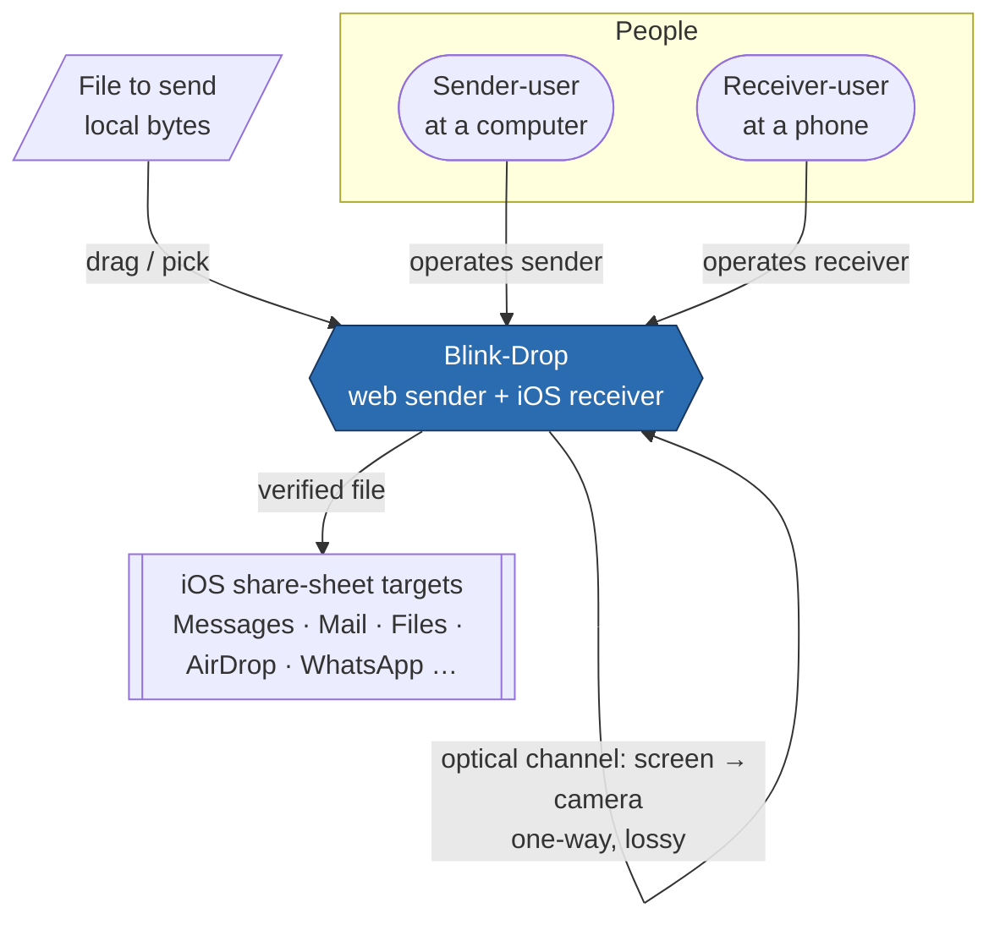
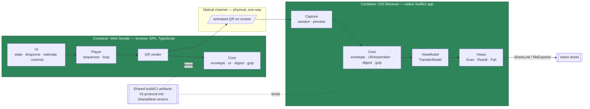
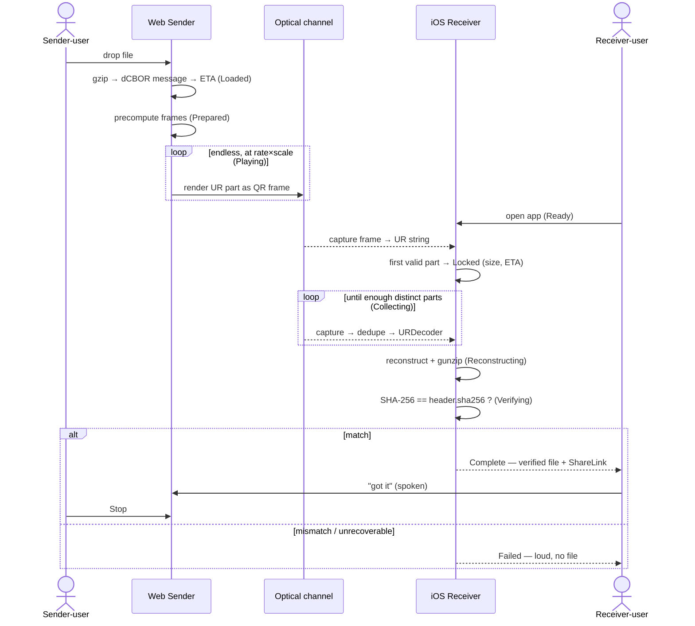

# Blink-Drop — Architecture Design

> **⚠️ Amended by [`blink-drop-architecture-update.md`](blink-drop-architecture-update.md) (update-1, 2026-07-07).** The receiver **pivoted from a native iOS app to an installable PWA** (the developer has no Mac). Read this base design **as patched by that note** — treat *every* native-iOS receiver detail below (SwiftUI / AVFoundation / URKit / AVCaptureMetadataOutput / ShareLink / Xcode / ADR-0006) as **superseded** (ADR-0006 → ADR-0009). The sender, protocol, `web/src/core`, and test vectors are unchanged. Note also: the sender's QR-generation library is **`qrcode-generator` (kazuhikoarase)**, not the nayuki library named elsewhere in this base (nayuki's is not published to npm).
>
> **⚠️ Also amended by update-2 (2026-07-07): DEC-1 reversed.** Opt-in passphrase encryption **shipped (v0.3)**. Treat every "no v1 confidentiality" / "v1.1 encryption" / "passphrase between file and gzip" statement below (§1.4, §4.3, §17.4–17.5, ADR-0007, R-4, §23.7, §26–27, W3) as **superseded** — confidentiality is now **opt-in** (AES-256-GCM + PBKDF2; compress-**then**-encrypt; metadata sealed), with plaintext still the default. Details: the update note's **Update-2 addendum + ADR-0010**, and [`07-implementation-plan-v0.3-encryption.md`](07-implementation-plan-v0.3-encryption.md).
>
> **⚠️ Also amended by update-3 (2026-07-07): opt-in Argon2id.** A memory-hard KDF alternative to PBKDF2 shipped (v0.4); the built pages add **`'wasm-unsafe-eval'`** to `script-src` for its WebAssembly (egress still forbidden). Treat §17.2 / §17.7 "strict `script-src` / no eval" and any "PBKDF2 only" framing as **superseded**. Details: the update note's **Update-3 addendum + ADR-0011**, and [`09-implementation-plan-argon2.md`](09-implementation-plan-argon2.md).
>
> **⚠️ Also amended by update-4 (2026-07-07): resume + data-at-rest.** The receiver **resumes an interrupted scan** by persisting a partial **encrypted at rest** (AES-GCM under a receiver-local non-extractable key in IndexedDB). Treat every "no durable storage" / "no resume in v1" / "no secrets stored" statement below (§1.3, §4.4, §13.4, §14.4, §17.4) as **superseded**. Details: the update note's **Update-4 addendum + ADR-0012**, and [`11-implementation-plan-resume.md`](11-implementation-plan-resume.md).

## Contents

1. [Executive Architecture Summary](#1-executive-architecture-summary)
2. [Source Blueprint Interpretation](#2-source-blueprint-interpretation)
3. [Clarification Summary](#3-clarification-summary)
4. [Architecture Goals and Constraints](#4-architecture-goals-and-constraints)
5. [Solution Strategy](#5-solution-strategy)
6. [Traditional Software vs AI-Agent Boundary](#6-traditional-software-vs-ai-agent-boundary)
7. [Recommended Tech Stack (provisional)](#7-recommended-tech-stack-provisional)
8. [System Context View](#8-system-context-view)
9. [Container / Runtime View](#9-container--runtime-view)
10. [Component View](#10-component-view)
11. [AI / Skill / MCP Architecture](#11-ai--skill--mcp-architecture)
12. [Interface Contracts](#12-interface-contracts)
13. [Data Contracts and Schemas](#13-data-contracts-and-schemas)
14. [State, Storage, and Data Lifecycle](#14-state-storage-and-data-lifecycle)
15. [Workflow / Sequence Views](#15-workflow--sequence-views)
16. [Observability, Logging, Telemetry, and Audit](#16-observability-logging-telemetry-and-audit)
17. [Security and Trust Boundaries](#17-security-and-trust-boundaries)
18. [Failure Handling and Recovery](#18-failure-handling-and-recovery)
19. [Testing and Evaluation Architecture](#19-testing-and-evaluation-architecture)
20. [Deployment Architecture](#20-deployment-architecture)
21. [Architecture Decision Records](#21-architecture-decision-records)
22. [Technical Risks and Trade-offs](#22-technical-risks-and-trade-offs)
23. [Experience Architecture](#23-experience-architecture)
24. [Recommended Next Stages and Downstream Handoffs](#24-recommended-next-stages-and-downstream-handoffs)
25. [Open Questions](#25-open-questions)
26. [Architecture Quality-Gate Self-Check](#26-architecture-quality-gate-self-check)
27. [Handoff Notes for Implementation Planning](#27-handoff-notes-for-implementation-planning)

## Update History

| Date | Source Blueprint | Architecture Version | Change Type | Affected Sections | Notes |
|------|------------------|----------------------|-------------|-------------------|-------|
| 2026-07-07 | `00-blueprint.md` v0.4 | v0.1 | Initial design | all | First architecture from blueprint + `01-protocol.md` v0.1; major decisions pre-confirmed by user |

---

## 1. Executive Architecture Summary

**1.1 What this is.** Blink-Drop is two independent, fully client-side applications that cooperate over a one-way optical channel (a screen showing animated QR codes, watched by a phone camera) to move a small file from a computer to a phone with no network, cable, cloud, pairing, or accounts. This document is the technical architecture for the *pair*; the byte-level wire contract is fixed separately in `01-protocol.md` (adopt Blockchain Commons UR/MUR) and is cited, not restated, here.

**1.2 Shape.** Two containers, hard-separated:
- **Web Sender** — a static, single-file browser SPA (TypeScript) that turns a file into an animated QR stream.
- **iOS Receiver** — a native SwiftUI app that scans the stream, reconstructs and cryptographically verifies the file, and hands it to the iOS share sheet.

Their only shared surface is `01-protocol.md` + `shared/test-vectors/`. Neither imports the other; either is extractable to its own repository.

**1.3 Defining constraints (all shape the design):** no server / no network by construction; no AI components (pure deterministic software — the Traditional-vs-AI matrix in §6 is entirely "traditional"); no durable storage beyond a transient reconstructed file; a lossy, unordered, one-way channel handled by fountain coding; and honest, verify-before-accept behaviour.

**1.4 Key decisions (full ADRs in §21):** adopt UR/MUR (ADR-0001); two-container hard split (ADR-0002); client-only, network-absent (ADR-0003); no AI (ADR-0004); vanilla TS + Vite + single-file offline (ADR-0005); SwiftUI + iOS 17 + URKit + AVCaptureMetadataOutput (ADR-0006); SHA-256 file-acceptance gate + CRC-32 transport, no v1 confidentiality (ADR-0007); gzip compression (ADR-0008).

**1.5 Warnings carried from the self-check (§26), echoed here and in §27:**
- **W1 (throughput/UX):** UR's Bytewords encoding doubles payload→QR characters, so realistic goodput is ~6–9 KB/s; the UX must set expectations. Non-blocking; required action: keep the pre-transfer ETA and honest progress (§23).
- **W2 (capture throughput):** `AVCaptureMetadataOutput` may coalesce frames below the needed distinct-frame rate; the Vision fallback is the mitigation and must be validated on-device (Open Question OQ-A, §25). Non-blocking at design stage.
- **W3 (confidentiality):** v1 has none by decision (DEC-1); the UI must not imply privacy. Non-blocking; product decision recorded.

**1.6 Metadata.**

| Field | Value |
|-------|-------|
| project_name | Blink-Drop |
| source_blueprint | `docs/00-blueprint.md` v0.4 |
| source_protocol | `docs/01-protocol.md` v0.1 (authoritative wire contract) |
| topic_slug | `blink-drop` |
| target_deployment | local (two client apps; no server/cloud) |
| operating_mode | hybrid (major decisions pre-confirmed; no live clarification required) |
| output_detail | standard |
| Clarification count | 12 (see §3 — all pre-confirmed or recorded assumptions) |
| Assumptions made | 5 (see §4.9) |
| ADR count | 8 (§21) |
| skill_version | architecture (design mode); version `unknown` |

---

## 2. Source Blueprint Interpretation

**2.1 Product thesis (from blueprint §1 + Product Experience Direction).** *Point your phone at a screen; the file arrives, verified — no setup, no pairing, no accounts.* Move small files across an optical air gap.

**2.2 Actors.** Sender-user (drives the web page on a computer) and Receiver-user (drives the phone app) — frequently the *same* person with two devices. No other actors; no operators, no services.

**2.3 MVP staging (blueprint §9 In-list; roadmap M0–M4).**
- **MVP-0 (smallest demonstrable):** protocol proven browser→camera end to end (roadmap M0) — file encoded, animated, captured, reconstructed, SHA-256-verified.
- **MVP-1 (first usable):** native iOS receiver scanning the web sender, verify, share-sheet export (roadmap M1–M2).

**2.4 Capabilities parsed → architecture responsibilities.** compress → partition → fountain-encode → render (sender); capture → dedupe → reassemble → decompress → verify → export (receiver). All map to `Core` + shell components in §10.

**2.5 Conceptual objects (blueprint §7):** Session, Frame/Part, Transfer (receiver-side state). Realised as data contracts in §13 and the state model in §14.

**2.6 What the protocol already fixes (cited, not redesigned):** the Message envelope (`[header, payload]`, protocol §4), the Part CBOR (`seqNum/seqLen/messageLen/checksum/data`, protocol §5), Bytewords→uppercased-alphanumeric-QR rendering (protocol §6), the two-checksum integrity model (protocol §7), gzip opacity + `orig_size` bound (protocol §8–§9), and the two-tier test vectors (protocol §10).

**2.7 Traceability map (blueprint → architecture).**

| Blueprint element | Architecture home |
|-------------------|-------------------|
| R-SUBSET / R-SELFDESC / R-META | UR/MUR via libraries (§7, §12); state/progress §14, §23 |
| R-INTEGRITY | §17 security gate SG-1 (SHA-256), §18 verify-fail path |
| R-DEDUPE / R-SESSION | Receiver `Capture` + `URAssembler` (§10, §12) |
| R-ADJUST | Sender `Player` presentation knobs (§10, §12); state §14 |
| R-OFFLINE | §3 data-egress `local_only`; §17; §20 packaging |
| §6.1 / §6.2 state machines | §14 canonical state model; §23 Experience Architecture |
| Product Experience Direction | §23 Experience Architecture |
| Recommended Next Stages | §24 |

---

## 3. Clarification Summary

Operating mode is **hybrid**, but every high-impact decision was resolved *before* this stage — four by explicit user answer on 2026-07-07, six as proposed defaults the user reviewed and did not veto, and the wire-level items by `01-protocol.md`. No new architecture-level clarification questions were required (per the skill rule: never ask what the blueprint or codebase already answers). Decisions and provenance:

| # | Decision | Value | Provenance | Review requirement |
|---|----------|-------|------------|--------------------|
| C-1 | Stream format | Adopt UR/MUR (URKit + @ngraveio/bc-ur) | user-confirmed (AskUserQuestion 2026-07-07) | none — locked (ADR-0001) |
| C-2 | Container topology | Two hard-separated clients | user-confirmed | none — locked (ADR-0002) |
| C-3 | Backend | None; client-only, no network | user-confirmed (implied by offline requirement) | none — locked (ADR-0003) |
| C-4 | Web stack | vanilla TS + Vite | user-confirmed | none — locked (ADR-0005) |
| C-5 | Offline packaging | single-file HTML | user-confirmed | none — locked (ADR-0005) |
| C-6 | iOS install/deploy | free Apple ID + Xcode sideload | user-confirmed | none — locked (§20) |
| C-7 | iOS UI + min OS | SwiftUI, iOS 17 | user-accepted-default | low — revisit only if an API need appears |
| C-8 | Camera/QR decode | AVCaptureMetadataOutput (+Vision fallback) | architecture-decision | **review** — validate throughput on-device (OQ-A) |
| C-9 | Compression | gzip/DEFLATE | user-accepted-default | none — locked (ADR-0008) |
| C-10 | Digest | SHA-256(original), end-gate | user-accepted-default + protocol-fixed | none — locked (ADR-0007) |
| C-11 | Data egress | `local_only` (no external model, no network) | architecture-decision | none — structural |
| C-12 | AI usage | none anywhere | user-confirmed | none — locked (ADR-0004) |

---

## 4. Architecture Goals and Constraints

**4.1 Functional requirements.** Encode any file ≤ soft-ceiling into an endless UR/MUR QR stream; render it at adjustable rate/scale; capture, reassemble from any sufficient subset, decompress, verify SHA-256, and export via the iOS share sheet.

**4.2 Non-functional requirements.**
- **Reliability under loss:** reconstruct from ~`seqLen`+ε distinct frames regardless of order/loss (protocol §5).
- **Integrity:** no file is exposed unless SHA-256 matches (hard gate).
- **Offline:** both apps function with zero connectivity; sender ships as a self-contained artifact.
- **Latency envelope:** ~6–9 KB/s goodput (protocol §6); 100 KB ≤ 30 s (blueprint S1).
- **Simplicity/maintainability:** solo developer, one new to iOS — minimise moving parts and dependencies.

**4.3 Security/privacy constraints.** No network egress (structural); no secrets stored; no accounts. Confidentiality is out of scope for v1 by decision (DEC-1). Full model in §17.

**4.4 Data/retention.** No durable storage. The only persisted artefact is a *transient* reconstructed file written to a temporary location on the receiver immediately before share, removed on completion/abort (§14.4).

**4.5 Cost/latency.** No infrastructure cost (no servers). Latency is optical-channel bound, not compute bound.

**4.6 Team constraint.** One developer; comfortable on web, new to iOS. Drives: adopt libraries over hand-rolled codecs (ADR-0001), SwiftUI over UIKit, and the `docs/ios/primer.md` onboarding path.

**4.7 MVP-0 / MVP-1.** As §2.3.

**4.8 Explicit non-goals (blueprint §10).** No two-way channel, no large media, no general file-sharing, not a covert channel, no Android/desktop-native in v1.

**4.9 Assumptions.**

| ID | Assumption | Reversible? | Revisit trigger |
|----|------------|-------------|-----------------|
| A-1 | Prior-art optical envelope (~1 KB/frame pre-Bytewords, ~10 fps) transfers to the target device | yes | Sweep harness results (roadmap M3) |
| A-2 | `AVCaptureMetadataOutput` sustains enough distinct-frame throughput at ~8–10 fps | yes | On-device M1 testing → Vision fallback (OQ-A) |
| A-3 | One cooperating human per side can exchange the spoken cues that close the one-way loop | yes | If an unattended-receiver need appears |
| A-4 | Single-file HTML (bc-ur + qrcode-generator inlined) stays within practical browser limits | yes | Build size review at M4 |
| A-5 | gzip via native APIs is available and adequate on both platforms | yes | If a platform lacks it, bundle a codec (rejected default) |

---

## 5. Solution Strategy

**5.1 Strategy in one line.** Push all the hard, shared, error-prone concerns (fountain coding, framing, cross-part binding, reassembly) into a *reference-tested library on each side* (UR/MUR), and keep Blink-Drop's own code to a thin, pure, symmetric **`Core`** envelope (file ⇄ gzip ⇄ dCBOR message ⇄ digest) plus platform shells (render/capture/UI).

**5.2 Symmetry as the organising principle.** `web/src/core` (TypeScript) and `ios/BlinkDrop/Core` (Swift) implement the *same* protocol envelope in two languages, and are pinned to agreement by the *same* `shared/test-vectors/`. This is what makes the hard container boundary safe: the contract is executable, not prose.

**5.3 Push complexity to the edges of certainty.** Deterministic, testable code (`Core`) is maximised and unit-tested in CI; the parts that can only be validated on real hardware (camera capture, optical decode) are isolated into the thinnest possible shell so the untestable-in-CI surface is small (§19).

**5.4 No premature services.** The two conceptual halves are two *client apps*, not a fleet of services. There is no server because there is deliberately no network (ADR-0003).

**5.5 Reversibility.** The library adoption (ADR-0001) is the one large lock-in; it is mitigated by the `Core` seam — Blink-Drop code depends on a thin internal wrapper (`ur.ts` / `URAssembler.swift`), not on library types spread through the app, so a future codec swap stays local.

---

## 6. Traditional Software vs AI-Agent Boundary

**Blink-Drop contains no AI/LLM/agent components.** It is pure deterministic software. The matrix below exists to make that explicit and to satisfy the boundary review — every responsibility is owned by traditional software; none is delegated to a model.

| Responsibility | Owner | Notes |
|----------------|-------|-------|
| Compression / decompression | Traditional (native gzip) | Deterministic |
| Partitioning + fountain coding | Traditional (UR/MUR library) | Deterministic given seed |
| QR render / decode | Traditional (qrcode-generator / AVFoundation) | Deterministic |
| Integrity verification | Traditional (SHA-256) | Cryptographic gate |
| State transitions | Traditional (view-model / UI state) | §14 |
| File export | Traditional (iOS share sheet) | OS-provided |
| Any language/judgment/reasoning task | — | **None exists in this product** |

**MCP:** not applicable — there is no reusable external tool/data access to expose or consume. **Prompt-injection / model-safety controls:** not applicable — no model. **Durable-state-under-AI-control risk:** not applicable — no AI. This section is intentionally closed.

---

## 7. Recommended Tech Stack (provisional)

Per the pipeline discipline, `design` records the stack as **provisional**; here it is provisional *but user-confirmed* (blueprint Recommended Next Stages routes `tech-stack-selection` to **DEFER — mostly decided**). Run `architecture --mode stack` only if a formal stack dossier is wanted; nothing below is expected to change.

| Decision | Recommendation | Alternatives | Rationale | Risks | Reversible? |
|----------|----------------|--------------|-----------|-------|-------------|
| Stream codec | UR/MUR (URKit, @ngraveio/bc-ur) | Custom fountain (LT/Raptor) + custom frame | Reference-tested both platforms; skips hardest code; wallet-proven | Bytewords 2× tax (W1); library API constraints | Medium (isolated behind `Core` seam) |
| Web language/build | TypeScript + Vite | Svelte/React; plain JS | Single-purpose app needs no framework; Vite → single-file offline | Minimal | High |
| Web offline packaging | `vite-plugin-singlefile` | PWA; multi-file | Cold air-gapped machine (U1) | Inline size (A-4) | High |
| Web QR gen | `qrcode-generator` (kazuhikoarase) | `qrcode` npm; qrcode-generator | Explicit alphanumeric+version+ECC-L control (protocol §6) | None material | High |
| Web compress / digest | native `CompressionStream` / WebCrypto | bundled zlib/js-sha256 | Zero-dependency; clean single-file | Older-browser support | High |
| iOS UI | SwiftUI | UIKit | Least boilerplate for a first iOS app; `ShareLink`, `@Observable` (iOS 17) | Newer API surface | Medium |
| iOS min OS | iOS 17 | 16 / latest | Ergonomics + headroom; device runs latest | Excludes <17 (irrelevant personal use) | Medium |
| iOS codec | URKit (SPM) | port bc-ur | Reference implementation | SPM version pinning | Medium |
| iOS capture/decode | AVCaptureMetadataOutput | Vision `VNDetectBarcodesRequest` | Simplest real-time string decode | Throughput coalescing (W2, OQ-A) | High (fallback documented) |
| iOS digest / gunzip / share | CryptoKit / Compression(zlib) / ShareLink+fileExporter | third-party | Native, no deps | None material | High |

**7.1 Provisional Tech Assumptions.** All rows are confirmed except iOS capture (C-8/OQ-A), which is a provisional pick with a documented fallback. gzip availability (A-5) is assumed on both platforms.

**7.2 Tech-Stack Selection Handoff.** Because §24 routes `tech-stack-selection` to DEFER (decided), the stack stays provisional-confirmed and no separate `…-architecture-tech-stack.md` is required for v1. Trigger to run `stack` mode: a decision above is reopened, or a formal dossier is requested.

---

## 8. System Context View



**External systems:** none over any network. The only "external" hand-off is the **iOS share sheet** (an OS service) receiving the verified file. There is no cloud, no backend, no third party. The optical channel is *internal* to the pair (a physical medium between the two containers), shown as the self-edge.

---

## 9. Container / Runtime View



**9.1 Containers.** Exactly two runtime containers — **Web Sender** (runs in a browser) and **iOS Receiver** (runs on iPhone). Neither is a service; neither listens on a socket. **`shared/`** (protocol + test vectors) is a *build/CI* artefact, not a runtime container.

**9.2 Ownership & boundary.** Each container owns its full stack top to bottom. The hard rule (ADR-0002): no source dependency crosses between `web/` and `ios/`; they agree only via `shared/`. Rationale for not splitting further into services: the conceptual components are cohesive within each client and share process state (the animation loop; the capture→assemble pipeline) — splitting them would add IPC for no benefit.

**9.3 Runtime characteristics.** Sender: single-threaded event loop + `requestAnimationFrame`; frames precomputed (blueprint L5). Receiver: camera capture on an AVFoundation queue, decode/assemble/verify off the main actor, UI on the main actor.

---

## 10. Component View

Component view is drawn for the **iOS Receiver** — the most complex container (asynchronous capture, fountain reassembly, verification gate, OS export). The Web Sender's components are listed for symmetry.

```mermaid
flowchart TB
    subgraph cap[Capture]
        CS[CaptureSession<br/>AVCaptureMetadataOutput → UR strings]
        DED[Dedupe<br/>drop repeat frames]
        CP[CameraPreview<br/>UIViewRepresentable]
    end
    subgraph core[Core  — pure, unit-tested vs shared vectors]
        URA[URAssembler<br/>wrap URKit URDecoder]
        ENV[Envelope<br/>CBOR decode → Header · bounded gunzip]
        DIG[Digest<br/>CryptoKit SHA-256 gate]
    end
    subgraph vm[ViewModel]
        TM[TransferModel<br/>@Observable · §14 states · progress]
    end
    subgraph views[Views  — SwiftUI]
        SV[ScanView]
        RV[ResultView<br/>ShareLink · fileExporter]
        FV[FailView]
    end

    CS --> DED --> URA --> ENV --> DIG --> TM
    CP --- SV
    TM --> SV & RV & FV

    classDef pure fill:#553c9a,stroke:#322659,color:#fff;
    class core pure;
```

**10.1 Web Sender components (symmetry).** `Core` (`envelope.ts`, `ur.ts`, `digest.ts`, `gzip.ts`, `types.ts`) · `qr/render.ts` · `player/{sequencer,loop}.ts` · `ui/{state,dropzone,estimate,controls}.ts`. `Core` never imports `qr`/`player`/`ui` and is the piece reused by the M0 browser-receiver prototype.

**10.2 Component boundaries (both sides).** `Core` is pure and deterministic (imports only the codec + platform crypto/compression). Everything device-specific (camera, canvas, DOM/SwiftUI) sits above `Core`. This is the seam that keeps the untestable-in-CI surface minimal (§19) and the codec swappable (§5.5).

---

## 11. AI / Skill / MCP Architecture

**Not applicable.** Blink-Drop has no AI/LLM/agent components (§6), exposes no MCP server, consumes no MCP tools, and offers no agent/skill surface. There is nothing to bound, permission, or audit in this dimension. Recorded explicitly so downstream stages do not infer an AI surface.

---

## 12. Interface Contracts

The **primary interface is the wire**, fully specified in `01-protocol.md` and treated here as fixed (cited, not restated). The contracts below are the remaining boundaries this architecture owns.

**12.1 Wire (optical) — `01-protocol.md` §4–§6 (authoritative).** Owner: protocol doc. Message `[header, payload]`; Part `[seqNum, seqLen, messageLen, checksum, data]`; rendered as uppercased `ur:blink-drop/…` in QR alphanumeric mode. Versioning: the `blink-drop` UR type string. Any change here is a protocol change (both sides + vectors). Blink-Drop code MUST NOT re-implement or diverge from it.

**12.2 `Core` encode contract (sender side).**
- Owner: `web/src/core`. **Input:** `{ bytes: Uint8Array, name: string, mediaType: string }`. **Output:** an iterator/emitter of UR part strings (via the codec) + `{ seqLen, messageLen }` for the ETA. **Errors:** `EmptyInput`, `TooLarge` (over hard ceiling). **Validation:** non-empty; size ≤ ceiling. **Observability:** log `seqLen`, `messageLen`, chosen `maxFragmentLen`.

**12.3 `Core` decode/verify contract (receiver side).**
- Owner: `ios/BlinkDrop/Core` (and mirrored in `web/src/core` for M0). **Input:** a stream of UR part strings. **Output on success:** `{ bytes, header }` only after SHA-256 matches. **Errors (all → *Failed*):** `Undecodable`, `MalformedMessage`, `DecompressionOverflow`, `DigestMismatch`. **Validation:** bounded gunzip at `header.orig_size` + hard cap (protocol §9); required header keys present. **Observability:** `part_received`, `message_reconstructed`, `verify_pass|verify_fail` (§16).
- This contract is bound to `Core` encode by `shared/test-vectors/` (tier-1 exact framing + tier-2 round-trip).

**12.4 Capture contract (receiver).** Owner: `Capture`. **Input:** camera frames. **Output:** deduped UR strings (lowercased) to `URAssembler`. **Errors:** `CameraPermissionDenied` (→ blocking UI), `NoCameraAvailable`. **Observability:** distinct-frame rate metric (feeds OQ-A).

**12.5 Presentation-control contract (sender, R-ADJUST).** Owner: `Player`. **Input:** `rate` (fps), `scale` (px/module) — the *only* mutable knobs. **Guarantee:** changing them re-times/redraws without altering fragment size/symbol version, so receiver progress is preserved (protocol §6). **Excluded:** fragment size is not a runtime input.

**12.6 File-export contract (receiver).** Owner: `Views` (ResultView). **Input:** a temp file URL for the verified bytes named `header.name`. **Output:** handoff to iOS `ShareLink` / `.fileExporter`. **Precondition:** SHA-256 passed (the temp file does not exist otherwise). **Errors:** user-cancel (benign, return to Complete).

**12.7 File-input contract (sender).** Owner: `ui/dropzone`. **Input:** drag-drop or file-picker `File`. **Output:** `{bytes,name,mediaType}` to `Core`. **Errors:** `EmptyInput`, over-ceiling warning (soft).

---

## 13. Data Contracts and Schemas

**13.1 Message envelope — `01-protocol.md` §4 (authoritative).**
```
message = [ header, payload ]
header  = { 1:name(tstr), 2:media_type(tstr), 3:orig_size(uint),
            4:sha256(bstr/32), 5:compression(uint 0|1) }
payload = bstr   ; gzip-compressed original, opaque
```
Untagged dCBOR at top level; UR type `blink-drop` supplies the type.

**13.2 Part — `01-protocol.md` §5 (authoritative).** `[seqNum, seqLen, messageLen, checksum(CRC-32), data]`, Bytewords-encoded.

**13.3 Test-vector schema — `01-protocol.md` §10 (authoritative).** Tier-1 `framing/` (`message.cbor.hex`, `parts.txt`, `params.json`) and tier-2 `roundtrip/` (`input.bin`, `meta.json`). This is the cross-language data contract binding both `Core`s.

**13.4 Storage owner, retention, lifecycle.**

| Data | Owner | Storage | Retention | Notes |
|------|-------|---------|-----------|-------|
| Sender file bytes | Web Sender (memory) | RAM only | Duration of session; never persisted, never networked | CSP forbids egress |
| Precomputed frames | Web Sender (memory) | RAM only | Session | Regenerated per file |
| Receiver in-flight parts | iOS `URAssembler` (memory) | RAM only | Until reconstruct/abort | No persistence (no resume in v1) |
| Reconstructed verified file | iOS Receiver | **temp file** (OS temp dir) | Until share completes / abort, then removed | The only on-disk artefact; created only after SHA-256 passes |

**13.5 Schema evolution.** The wire schema is versioned by the UR type string; a breaking change means a new type + regenerated vectors. No database, so no migrations. **Audit immutability:** not applicable — no audit store (§16).

---

## 14. State, Storage, and Data Lifecycle

The canonical state model. All state terms elsewhere resolve here. Three distinct kinds are kept separate (lifecycle states · operational condition flags · diagnostic events).

**14.1 Sender lifecycle states (blueprint §6.1).** `Idle → Loaded → Prepared → Playing ⇄ Paused → Stopped`. Transitions in §15 / blueprint §6.1 diagram.

**14.2 Receiver lifecycle states (blueprint §6.2).** `Ready → Locked → Collecting → Reconstructing → Verifying → Complete | Failed`; `Failed → Collecting` (keep scanning) or `Failed → Ready` (restart). Owned by `TransferModel`.

**14.3 Operational condition flags (NOT lifecycle states).** `stalled` (no new distinct part for N seconds — drives §23 stall guidance), `adjusting` (a presentation change is in flight on the sender). These overlay a lifecycle state; they are not states themselves.

**14.4 Data lifecycle.** No durable storage. Receiver: parts held in memory → reconstructed bytes → **temp file created only post-verification** → handed to share sheet → **removed on completion or abort**. Sender: bytes + frames in memory only, discarded on Stop. Abort at any point frees memory and any temp file; no resources persist (blueprint §6.5).

**14.5 Diagnostic events (NOT audit, NOT durable).** `session_locked`, `part_received`, `message_reconstructed`, `verify_pass`, `verify_fail`, `share_invoked` — emitted to local logs/UI only (§16). No security audit trail exists because the app holds no secrets, accounts, or multi-user state.

---

## 15. Workflow / Sequence Views

Main end-to-end transfer (happy path), one dynamic view:



Failure and adjustment sequences are covered in §18; the human-ACK cues ("got it" / "it's stuck" / "start over") are the blueprint §6.4 loop.

---

## 16. Observability, Logging, Telemetry, and Audit

**Design driver:** this is an offline, no-network, no-account, single-user-per-device app. **There is no remote telemetry and no durable audit trail — by construction and by privacy intent.** Sending observability data anywhere would violate R-OFFLINE and the no-egress posture (§17).

| Concern | Approach |
|---------|----------|
| **Logs** | Local only. Dev builds: `console`/Xcode console via the §14.5 diagnostic events. Release: minimal, on-device. Never networked. |
| **Metrics (user-facing)** | Live in-UI only: collection rate, collected/needed, ETA (receiver); elapsed, loop count (sender). Not exported. |
| **Metrics (tuning)** | The sweep harness (roadmap M3) records timing/success **locally** to a file for parameter tuning — a developer tool, not runtime telemetry. |
| **Traces / correlation IDs** | No cross-process/network tracing (no network). Within a device, the UR `checksum` (CRC-32) / file `sha256` serves as a session correlator for local debugging. |
| **Audit trail** | None. No security-relevant durable events; no secrets/accounts to audit. Recorded as a deliberate n/a, not an omission. |

**Progress↔event mapping (for §29 cross-consistency):** every testable progress item in §23.4 has a diagnostic event here — `Locked`→`session_locked`, collection→`part_received`, assembly→`message_reconstructed`, verification→`verify_pass|verify_fail`, export→`share_invoked`.

---

## 17. Security and Trust Boundaries

**17.1 Trust zones.**
- **Sender machine** — trusted to hold the file (it already has it).
- **Optical channel** — **untrusted / observable**: anything with line of sight or a screen recorder can read the frames. This is the core exposure (blueprint Risk 4).
- **Receiver device** — trusted to hold the reconstructed file.
- **iOS share-sheet targets** — the user's chosen destination; trust delegated to the user's selection.

**17.2 Data egress decision:** **`local_only`.** No content is sent to any network or external model — there is no external model (§6) and no network path. Web: CSP `connect-src 'none'` makes egress *structurally absent from the packaged artifact* (browser-enforced; not a claim about the host OS). iOS: no networking code, no network entitlement requested.

**17.3 Identity/access.** None — no accounts, no auth, no multi-user state. Not applicable by design.

**17.4 Secrets.** None stored or transmitted. (Future v1.1 encryption would introduce a passphrase, handled in `Core` between file and gzip — out of scope now, DEC-1.)

**17.5 Confidentiality (v1).** **None, by decision (DEC-1).** The UI must not imply privacy (W3). Recorded, not mitigated.

**17.6 Prompt-injection / model controls.** Not applicable (no model).

**17.7 Security quality gates (verification table — release-relevant).**

| Security Gate | Required Implementation Evidence | Verification Method | Blocks Release? |
|---------------|----------------------------------|---------------------|-----------------|
| **SG-1 SHA-256 file-acceptance** | No file path exposes bytes before `SHA-256(decompressed)==header.sha256`; mismatch → *Failed*, no temp file created | Unit test on tampered payload (tier-2 vector variant) + code review of the export path | **Yes** |
| **SG-2 Decompression bound** | gunzip aborts past `header.orig_size` + hard cap | Unit test with a decompression-bomb fixture | **Yes** |
| **SG-3 No network egress (web)** | CSP `connect-src 'none'`; no `fetch`/XHR/WebSocket in bundle | CSP present in built artifact + lint/grep for network APIs | **Yes** |
| **SG-4 No network egress (iOS)** | No networking APIs; no network entitlement | Code review + entitlement inspection | **Yes** |
| **SG-5 Malformed-input containment** | Bad Bytewords/CBOR/header → clean *Failed*, no crash, bounded memory | Fuzz/negative unit tests on `Core` | Yes |
| **SG-6 No secret/PII logging** | Diagnostic logs carry no file contents (filename only, and only locally) | Log-snapshot review | No (warning) |

**17.8 Prior security review.** DEC-2 was completed at the protocol stage — `01-protocol.md` §11 (confidentiality, integrity, frame injection/DoS, decompression bomb, session confusion, dual-use). This section operationalises those findings as SG-1…SG-6. Re-run the protocol-stage review if the wire format changes.

**17.9 External-model data-egress table.** Not applicable — no external model is used (egress is `local_only`, §17.2).

---

## 18. Failure Handling and Recovery

Per critical workflow (blueprint §6.5, protocol §9/§11):

| Failure | Detection | Handling | Recovery |
|---------|-----------|----------|----------|
| Random frame loss | Fountain shortfall | Absorbed by R-SUBSET — keep collecting | Automatic; no user action |
| Stall (no new distinct parts) | `stalled` flag (§14.3) | Show guidance: move closer/farther, reduce glare, steady phone | Sender may lower rate / enlarge (R-ADJUST) — progress preserved |
| Mid-loop join | Normal | Works from any part | Automatic |
| Digest mismatch (SG-1) | Verify step | → *Failed*, file withheld, loud message | Keep scanning or restart — never "accept anyway" |
| Decompression overflow (SG-2) | Inflate exceeds `orig_size`/cap | Abort → *Failed* | Restart transfer |
| Malformed part/message (SG-5) | Decode error | Drop part or fail cleanly; bounded memory | Continue / restart |
| Camera permission denied | Capture start | Blocking UI explaining the need | User grants in Settings |
| Capture throughput too low (W2) | Low distinct-frame rate | Fall back to Vision decode path (OQ-A) | Design-time switch |
| Competing session in view | Foreign `checksum` | Ignore non-locked session (R-SESSION) | Explicit user switch to change |
| App backgrounded mid-collect | Lifecycle event | Discard state (no resume v1) | Rescan (cheap via R-SUBSET) |
| Oversized file | Size check | Soft warning + honest ETA at *Loaded* | User decides |

Every critical workflow has an explicit failure path; none silently degrades.

---

## 19. Testing and Evaluation Architecture

**19.1 Cross-language correctness (the linchpin).** `shared/test-vectors/` (protocol §10) is run by **both** `Core`s in CI: tier-1 framing (byte-exact UR parts from a canonical compressed payload) and tier-2 round-trip (`SHA-256==meta.sha256`). This proves TypeScript and Swift agree on the wire without a shared runtime.

**19.2 Unit tests.** `web/src/core` (Vitest) and `ios/BlinkDrop/Core` (XCTest) — envelope, gzip bound (SG-2), digest gate (SG-1), malformed-input containment (SG-5). Pure, deterministic, CI-suitable.

**19.3 On-device tests (not CI).** Camera capture and optical decode are untestable in CI (no camera in the iOS Simulator). Validated manually on the real iPhone against the web sender / M0 receiver output. Kept small by the thin `Capture` shell (§10.2).

**19.4 Parameter sweep (evaluation).** The sweep harness (roadmap M3, blueprint L9) measures time/success across fragment size × rate on-device to tune protocol §6 seed values and validate S1/S3/S6. Local developer tool; no external eval service.

**19.5 No AI evaluation.** No model-backed evaluators or gating probes exist (§6) — probe-availability policy is n/a.

---

## 20. Deployment Architecture

No servers, no cloud, no CI/CD-to-production. "Deployment" = producing two client artefacts.

| Container | Build | Distribute | Run |
|-----------|-------|------------|-----|
| Web Sender | `vite build` + `vite-plugin-singlefile` → one `blink-drop.html` | Copy the file (USB / already present) to any machine, incl. air-gapped | Open in any modern browser; runs offline |
| iOS Receiver | Xcode build (SwiftUI + URKit via SPM) | Sideload to the personal iPhone via free Apple ID (`docs/ios/primer.md`) | Native app; re-sign ~weekly (free-account limit) |

**CI** runs the unit tests + test-vector conformance only (no deploy). **Deployment topology note:** the topology is intentionally trivial (local files + a sideloaded app) and carries no server/network attack surface — which is itself the security posture (§17.2). No component, deployment, or scaling concern beyond this.

---

## 21. Architecture Decision Records

**ADR-0001 — Adopt UR/MUR (not a custom codec).** *Status:* accepted (user-confirmed). *Decision:* use Blockchain Commons UR + Multipart UR via URKit (Swift) and @ngraveio/bc-ur (TS). *Why:* reference-tested fountain framing on both platforms; skips the hardest, most bug-prone code; wallet-proven. *Consequences:* Bytewords 2× tax (W1); bound to library APIs — isolated behind the `Core` seam (§5.5). *Alternatives:* custom LT/Raptor + custom frame (rejected: two-language codec to hand-build and cross-test before anything works).

**ADR-0002 — Two-container hard split.** *Status:* accepted. *Decision:* `web/` and `ios/` never depend on each other; share only `01-protocol.md` + `shared/test-vectors/`; either is repo-extractable. *Why:* orthogonality; independent evolution; the executable contract makes the boundary safe. *Consequences:* the wire + vectors are the sole coupling; changes there are cross-cutting.

**ADR-0003 — Client-only, no backend, no network.** *Status:* accepted. *Decision:* no server/cloud/network in v1. *Why:* the product's purpose is to work without a network; egress-`local_only` is a feature (privacy) and a simplification. *Consequences:* no remote telemetry/audit (§16); "deployment" is file distribution (§20).

**ADR-0004 — No AI components.** *Status:* accepted. *Decision:* pure deterministic software; no LLM/agent/MCP. *Why:* every task here is deterministic (compress/frame/render/decode/verify). *Consequences:* §6/§11 closed; no model-safety surface.

**ADR-0005 — Web stack: vanilla TS + Vite + single-file offline.** *Status:* accepted (user-confirmed). *Decision:* no framework; `vite-plugin-singlefile`; qrcode-generator; native `CompressionStream`/WebCrypto. *Why:* single-purpose app; cleanest offline artifact; fewest deps. *Consequences:* hand-rolled minimal UI state (acceptable at this size). *Alternatives:* Svelte/React (rejected: unneeded machinery, fiddlier single-file).

**ADR-0006 — iOS stack: SwiftUI + iOS 17 + URKit + AVCaptureMetadataOutput.** *Status:* accepted (UI/OS user-accepted-default; capture provisional). *Decision:* SwiftUI; iOS 17 floor; URKit via SPM; AVCaptureMetadataOutput for real-time string decode, Vision fallback. *Why:* least boilerplate for a first iOS app; native string decode fits UR (text). *Consequences:* capture throughput risk (W2/OQ-A) with a documented fallback. *Alternatives:* UIKit (more boilerplate); Vision-first (more CPU up front).

**ADR-0007 — Integrity: SHA-256 file-gate + CRC-32 transport; no v1 confidentiality.** *Status:* accepted (protocol-fixed + DEC-1). *Decision:* two-layer integrity (protocol §7); SHA-256 end-gate is mandatory (SG-1); no encryption in v1. *Why:* silent corruption must be impossible; confidentiality deferred to v1.1 for speed to a working system. *Consequences:* optical eavesdropping exposure (Risk 4); UI must not imply privacy (W3).

**ADR-0008 — Compression: gzip/DEFLATE.** *Status:* accepted. *Decision:* native gzip both sides; compressed bytes opaque; integrity on the decompressed original. *Why:* zero-dependency, keeps single-file packaging clean. *Consequences:* ~10–20% worse ratio than zstd (accepted for small files). *Alternatives:* zstd/brotli (rejected: added dependency both sides).

---

## 22. Technical Risks and Trade-offs

| # | Risk / trade-off | Impact | Mitigation |
|---|------------------|--------|------------|
| R-1 | Throughput ceiling + Bytewords 2× tax (W1) | Slow for larger files | Honest ETA + soft ceiling (§23); compress first |
| R-2 | Optical variability (glare/moiré/shake) | Decode failures | Stall guidance + rate/scale knobs (§18); on-device sweep (§19) |
| R-3 | AVCaptureMetadataOutput throughput (W2) | Missed frames at target fps | Vision fallback (OQ-A), validated M1 |
| R-4 | No v1 confidentiality (W3, DEC-1) | Credential exposure (U2) | Narrowed U2 scope (blueprint §2); v1.1 encryption; UI honesty |
| R-5 | Dual-use / exfiltration channel | Product-posture risk | Documented stance (blueprint Risk 7); nothing to enforce in wire |
| R-6 | Solo dev new to iOS | Delivery risk | Primer + M0 browser de-risk before native (roadmap) |
| R-7 | Free-account 7-day re-sign | Personal-use friction | Documented (primer §7); paid program optional later |
| R-8 | Library lock-in (UR) | Future codec change costly | `Core` seam isolates it (§5.5) |

---

## 23. Experience Architecture

Consumes the blueprint's **Product Experience Direction** (UX intent) and structures it for the `ux-design` stage. UX intent is preserved, not changed.

**23.1 Interaction surfaces (only two; no CLI/MCP/agent/API).**
- **Web Sender** (desktop/laptop browser): drop file → see plan (size, frames, ETA) → play animation → optional rate/scale controls.
- **iOS Receiver** (phone, camera-first): open → already scanning → progress → verified file → share sheet.

**23.2 Primary user & JTBD.** A technical user moving their own small file across an air gap when no network/cable/cloud is available. Thesis: *no ceremony — point and it arrives, verified.*

**23.3 User-visible states (map to §14).** Sender: Idle/Loaded/Prepared/Playing/Paused/Stopped. Receiver: Ready/Locked/Collecting/Reconstructing/Verifying/Complete/Failed. Overlays: `stalled`, `adjusting` (§14.3). Every state here exists in §14.

**23.4 Feedback / progress (testable; each maps to a §16 event & a §12 contract).**
- Receiver shows a *real* fraction of a known total from the first part (Locked→`session_locked`; collection→`part_received`); ETA from observed rate.
- Sender shows time + loop count only (it cannot know delivery on a one-way channel) — must never fake a delivery %.
- Completion is shown only after `verify_pass`; "all frames seen" is never "done".

**23.5 Error / empty / degraded / recovery UX (→ §18).** Empty: sender drop-zone hint; receiver "point at the animation". Stall: concrete guidance. Verify-fail: loud, file withheld, keep-scan/restart. Permission denied: blocking explainer.

**23.6 Human-in-the-loop.** The human *is* the acknowledgment channel (no machine back-path). Three cues — "got it" / "it's stuck" / "start over" — drive Stop, adjust, and abort respectively. This is the closest thing to a "review flow": a human confirming completion. Each cue maps to a §12 control (Stop; presentation adjust; abort) and a §14 transition.

**23.7 Trust / control / transparency.** Verified badge only post-SHA-256; honest, non-fabricated progress; **no privacy claims** in v1 (DEC-1). User keeps full control (adjust, abort, choose share target).

**23.8 UX handoff.** `ux-design` should detail: camera-framing guidance, progress-ring behaviour and thresholds for `stalled`, the verify success/fail moments, and the share/save flow — weighted ~80% to the receiver (the failure-prone surface). No new operations may be invented; gaps → architecture feedback.

---

## 24. Recommended Next Stages and Downstream Handoffs

Consumes the blueprint's **Recommended Next Stages**.

| Stage | Decision | Depends on | Notes |
|-------|----------|------------|-------|
| **ux-design** | **RUN (next)** | this document | Input contract now satisfied (formal architecture-design doc with Experience Architecture §23, State Model §14, Interface Contracts §12). Receiver-weighted. |
| tech-stack-selection (`--mode stack`) | **DEFER** | this document | Stack provisional-but-confirmed (§7); run only for a formal dossier or if a decision reopens. |
| security-review | **DONE** | — | Completed at protocol stage (`01-protocol.md` §11 → §17 SG-1…SG-6). Re-run if wire changes. |
| test-design | **DEFER** | ux-design | Covered interim by test vectors + sweep (§19) + ux-design E2E seeds; formalize at implementation-plan. |
| implementation-plan | **RUN (after ux-design)** | ux-design | Skill not installed → hand-rolled; `04-roadmap.md` seeds M0–M4 + the design gate. |
| architecture-update / reconcile | **DEFER** | ux-design feedback | Run `--mode reconcile` if ux-design raises architecture feedback (§23.8). |

**Provisional-tech handoff:** because tech-stack-selection is DEFER, the §7 stack stays provisional-confirmed; no separate tech-stack doc is required for v1.

---

## 25. Open Questions

| ID | Question | Owner stage | Notes |
|----|----------|-------------|-------|
| OQ-A | Does `AVCaptureMetadataOutput` sustain enough *distinct*-frame throughput at ~8–10 fps, or is the Vision fallback needed? | implementation (M1 on-device) | W2/R-3; fallback already designed (§18) |
| OQ-B | Final `maxFragmentLen` / rate defaults | sweep harness (M3) | Protocol §6 seed values pending measurement (A-1) |
| OQ-C | Register the `blink-drop` UR type with Blockchain Commons? | later / optional | Functional without it (protocol §5); courtesy for interop |
| OQ-D | Single-file HTML size with bc-ur + qrcode-generator inlined — within comfortable limits? | M4 build review | A-4 |

None blocks the ux-design stage.

---

## 26. Architecture Quality-Gate Self-Check

| Gate | Status | Finding / required action | Blocks TD? |
|------|--------|---------------------------|-----------|
| Traceability (map exists; decisions traced) | PASS | §2.7 map; every ADR traces to blueprint/protocol/user decision | No |
| Document completeness (27 sections + Contents + Update History + metadata) | PASS | All present | No |
| Tech stack (rationale/alternatives/reversibility) | PASS | §7 table complete | No |
| AI boundary (matrix; no AI mutating durable state) | PASS | §6 — no AI exists; closed | No |
| C4 coverage (context/container/dynamic) | PASS | §8/§9/§15; component §10 | No |
| Contracts/data/security/observability/failure present | PASS | §12–§18 | No |
| MVP & ADRs (MVP-0/1 respected; ADRs for high-impact) | PASS | §2.3; 8 ADRs §21 | No |
| Technology-specific validity (no overclaimed guarantees) | PASS | CSP framed as browser-enforced/structural, not absolute (§17.2) | No |
| Data-egress decision present | PASS | `local_only` §17.2; external-model table n/a §17.9 | No |
| State-semantics consistency | PASS | §14 separates states / flags / events | No |
| Security gate format (verification table) | PASS | §17.7 table, not checkboxes | No |
| Capture throughput | **WARNING (W2)** | Required action: validate on-device at M1; Vision fallback ready (OQ-A) | No |
| Confidentiality | **WARNING (W3)** | Required action: UI must not imply privacy; v1.1 encryption (DEC-1) | No |
| Throughput/UX expectation | **WARNING (W1)** | Required action: keep ETA + honest progress (§23) | No |
| Cross-section consistency (§23↔§12/§14/§16) | PASS | §23 operations/states/progress all resolve (§23.3/§23.4 notes) | No |
| Build-sequencing cap (≤5 in §27) | PASS | §27 has 5 | No |

No FAIL rows. Three WARNINGs (W1–W3), all non-blocking, echoed in §1 and §27 with required actions.

---

## 27. Handoff Notes for Implementation Planning

**27.1 Warnings to carry (from §26).** W1 throughput/UX (keep honest ETA + progress); W2 capture throughput (validate on-device M1, Vision fallback ready); W3 no v1 confidentiality (UI must not imply privacy). All non-blocking.

**27.2 High-level build sequencing (≤5 constraints; detail belongs to implementation-plan / `04-roadmap.md`).**
1. Author `shared/test-vectors/` first — both `Core`s and M0 depend on it.
2. Build `web/src/core` and prove it both directions against the vectors before any UI.
3. M0 (browser sender + throwaway browser receiver reusing `web/src/core`) validates the protocol on real optics before any Xcode work.
4. Native receiver (M1) only after M0 + the ux-design stage.
5. Tune protocol §6 defaults via the sweep harness (M3) before shipping (M4).

**27.3 Mandatory, non-negotiable implementation gates.** SG-1 (SHA-256 end-gate — no file exposed before verify) and SG-2 (decompression bound) are release-blocking (§17.7).

**27.4 Next stage.** Run **`ux-design`** on this document (receiver-weighted, §23.8). If it surfaces architecture gaps, run `architecture --mode reconcile`.

**27.5 Repositioned prior docs.** The hand-rolled `docs/web/architecture.md` and `docs/ios/architecture.md` (module maps, file layouts) are lower-altitude implementation detail; treat them as inputs to the implementation-plan stage, superseded at the architecture altitude by this document.
