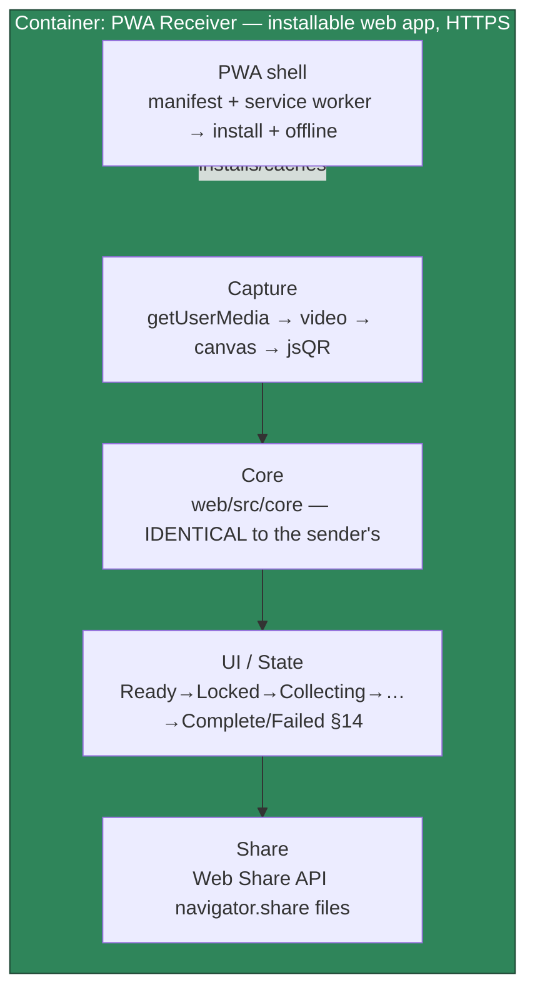

# Blink-Drop — Architecture Update Note

> **This note amends `blink-drop-architecture-design.md` v0.1.** Until a future
> `materialize`, read the base design **as patched by §5 (Patch Manifest) below**.
> Only the **receiver container** changes; the sender, wire protocol
> (`01-protocol.md`), transfer model, `web/src/core`, and `shared/test-vectors`
> are **unchanged**.

## Contents

1. [Generation Metadata](#1-generation-metadata)
2. [Resolved Input Artifacts](#2-resolved-input-artifacts)
3. [Update Summary](#3-update-summary)
4. [Accepted Decision and Source](#4-accepted-decision-and-source)
5. [Patch Manifest](#5-patch-manifest)
6. [ADR Changes](#6-adr-changes)
7. [Revised Receiver Container and Components](#7-revised-receiver-container-and-components)
8. [Revised Interface Contracts (receiver)](#8-revised-interface-contracts-receiver)
9. [Revised Security and Trust Boundaries](#9-revised-security-and-trust-boundaries)
10. [Revised Deployment](#10-revised-deployment)
11. [Technical Risks — Added / Changed / Removed](#11-technical-risks--added--changed--removed)
12. [Feedback Closure Matrix](#12-feedback-closure-matrix)
13. [Blueprint Reconciliation Handoff and Update Verdict](#13-blueprint-reconciliation-handoff-and-update-verdict)

## Update History

| Date | Base Architecture | Update Version | Change Type | Affected Base Sections | Notes |
|------|-------------------|----------------|-------------|------------------------|-------|
| 2026-07-07 | `blink-drop-architecture-design.md` v0.1 | update-1 | Container pivot (accepted decision) | §2.3, §4.6, §7, §9, §10, §12, §17, §18, §19, §20, §22, §23, §24; ADR-0006 superseded | Receiver: native iOS app → installable PWA (developer has no Mac) |
| 2026-07-07 | `blink-drop-architecture-design.md` v0.1 | update-2 | Decision reversal (feature) | §12, §13, §14, §17, §22, §23, §26, §27; ADR-0007 amended, ADR-0010 new | **DEC-1 reversed**: opt-in passphrase encryption shipped (v0.3). See the Update-2 addendum + `docs/07-implementation-plan-v0.3-encryption.md`. |
| 2026-07-07 | `blink-drop-architecture-design.md` v0.1 | update-3 | Feature (KDF option) + CSP change | §17 (CSP/SG), §22; ADR-0010 amended, ADR-0011 new | Argon2id **opt-in** KDF (v0.4); `'wasm-unsafe-eval'` added to CSP. See the Update-3 addendum + `docs/09-implementation-plan-argon2.md`. |
| 2026-07-07 | `blink-drop-architecture-design.md` v0.1 | update-4 | Feature (resume) + data-at-rest | §10, §14, §17; ADR-0012 new | Receiver resume across restart; partial stored **encrypted at rest** (v0.6). See the Update-4 addendum + `docs/11-implementation-plan-resume.md`. |
| 2026-07-07 | `blink-drop-architecture-design.md` v0.1 | update-5 | Feature (multi-file) + wire change | §4.2 (protocol), §12, §14, §17; ADR-0013 new | Multi-file transfer (v0.7): per-file verify + individual Web Share (+ `.zip` fallback v0.7.1); DEC-2 re-run. See the Update-5 addendum + `docs/13-implementation-plan-multifile.md`. |

---

## 1. Generation Metadata

| Field | Value |
|-------|-------|
| mode | `update` (applies an accepted decision into an update note; base design not overwritten) |
| base_architecture | `docs/blink-drop-architecture-design.md` v0.1 |
| blueprint | `docs/00-blueprint.md` v0.4 |
| protocol (unchanged) | `docs/01-protocol.md` v0.1 |
| update_source | Explicit user decision, 2026-07-07 |
| topic_slug | `blink-drop` |
| Patch entries | 13 (§5) — **update-1 scope only; see the Update-History table + Update-2/3/4 addenda for later patches** |
| ADRs changed | update-1: 1 superseded (ADR-0006), 1 new (ADR-0009). **Later: ADR-0007/0010 amended; ADR-0010/0011/0012 new — see Update-History** |
| Architecture Update Required? | **Yes — applied by this note** |
| skill_version | architecture (update mode); version `unknown` |

## 2. Resolved Input Artifacts

| Artifact | Path | Role |
|----------|------|------|
| Base architecture design | `docs/blink-drop-architecture-design.md` v0.1 | Document being amended |
| Blueprint | `docs/00-blueprint.md` v0.4 | Source of intent; reconciliation flagged in §13 |
| Protocol spec | `docs/01-protocol.md` v0.1 | Fixed constraint — unchanged |
| iOS architecture (now deferred) | `docs/ios/architecture.md`, `docs/ios/primer.md` | Reclassified as the *future native* stage reference |
| Proven prototype | `web/` (sender + browser receiver), `shared/test-vectors/` | The PWA receiver is built on this already-proven code |

## 3. Update Summary

**What:** The **receiver** changes from a *native iOS app* to an *installable
Progressive Web App (PWA)* — a static web app that reuses `web/src/core`
verbatim, decodes the camera with `getUserMedia` + jsQR (both already proven on
real iPhone optics), verifies with the existing SHA-256 gate, and exports via the
**Web Share API** (which opens the real iOS share sheet on iOS 16.4+).

**Why:** A hard external constraint — the developer has **no Mac**, and native
iOS development (Xcode, iOS SDK, code signing, SwiftUI/AVFoundation/CryptoKit) is
macOS-only. The PWA path needs no Mac, is **buildable and testable on Linux**
(the developer's machine, with browser automation), and runs on the target
iPhone today over HTTPS.

**Blast radius:** receiver container only. The sender, protocol, `web/src/core`,
and test vectors are untouched. The M0 "throwaway" browser receiver is
**promoted from prototype to the product foundation**.

**Net effect on risk:** *lower* overall — the previously highest project risk
(solo developer new to a native platform, plus untestable-in-CI camera) largely
evaporates because the receiver is now web tech the developer already commands
and can test locally. New, smaller risks appear (HTTPS requirement, install-once
offline story, Web Share fidelity) — §11.

## 4. Accepted Decision and Source

| Field | Value |
|-------|-------|
| Decision | Pivot the receiver from native iOS to an installable PWA |
| Source | **Explicit user decision**, 2026-07-07 (AskUserQuestion: "No Mac — pivot to a PWA receiver") |
| Provenance | `user-confirmed` (explicit selection) |
| Driver | External hard constraint: no Mac; iOS native toolchain is macOS-only |
| Reversibility | Medium — the native iOS app is **deferred, not cancelled**; `docs/ios/*` remain the future-native reference, and `web/src/core` is language-shared groundwork. Revisit trigger: a Mac becomes available and a native app is desired. |

## 5. Patch Manifest

> **Scope of this amendment (2026-07-07):** the base design's top banner declares the pivot **holistic** — *every* native-iOS receiver detail in the base is superseded, not only the rows listed here. This manifest names the load-bearing sections; residual native content elsewhere in the base (§1, §3, §5, §6, §8, §13.4, §15–§16, §25–§27) is likewise superseded, and a future `materialize` should patch it. (P-3 below patches the §7 receiver **rows**, plural.)

Each row patches the correspondingly-numbered base-design section. Change types:
**REPLACE** (supersede content), **AMEND** (add/adjust), **UNCHANGED** (listed
for cross-reference).

| # | Base section | Change | Patched content (summary) |
|---|--------------|--------|---------------------------|
| P-1 | §2.3 MVP staging | AMEND | **MVP-1 = the PWA receiver** (scan → verify → Web Share), buildable/testable on Linux. MVP-0 unchanged. |
| P-2 | §4.6 Team constraint | AMEND | Add the binding constraint **"no Mac"** → drives the PWA choice (was: "new to iOS, sideload via Xcode"). |
| P-3 | §7 Tech stack (receiver row) | REPLACE | Receiver stack → **installable PWA**: vanilla TS + Vite; `web/src/core` reused verbatim; camera `getUserMedia` + jsQR; verify WebCrypto SHA-256; share **Web Share API** (fallback download link); **web app manifest + service worker**. (Sender rows unchanged.) |
| P-4 | §9 Container view | REPLACE | The "iOS Receiver (SwiftUI)" container becomes **"PWA Receiver (browser / installed web app)"**. Two containers still; both now web-tech, still hard-separated, still sharing only `01-protocol.md` + test vectors. |
| P-5 | §10 Component view | REPLACE | Receiver components → **Capture** (`getUserMedia` → video → canvas → jsQR), **Core** (`web/src/core`, *identical to the sender's*), **UI/State** (Ready→…→Complete/Failed, §14 unchanged), **Share** (Web Share API), **PWA shell** (manifest + service worker). |
| P-6 | §12 Interface contracts | REPLACE (§12.4, §12.6) | §12.4 capture: `getUserMedia`/jsQR contract (was AVCaptureMetadataOutput). §12.6 export: **Web Share API** `navigator.share({files})` (was ShareLink/fileExporter). Others unchanged. See §8. |
| P-7 | §14 State model | UNCHANGED | Receiver lifecycle states (Ready → Locked → Collecting → Reconstructing → Verifying → Complete/Failed) are identical; only the implementing tech differs. |
| P-8 | §17 Security & egress | AMEND | Egress nuance: the PWA **app code** is fetched once over HTTPS from GitHub Pages; the **transferred file stays local** (never uploaded; Web Share is on-device). Runtime data-egress still forbidden by CSP. SG-4 (iOS no-network entitlement) → **SG-4′**: CSP `connect-src` limited to same-origin app assets only; no file egress. See §9. |
| P-9 | §18 Failure handling | AMEND | Add: **HTTPS required** for camera (insecure origin → clear "must be opened over https" message); **camera permission denied** (same UX); **offline after install** (service-worker-cached; first load needs network). Remove the AVFoundation-throughput fallback row (native-only). |
| P-10 | §19 Testing architecture | AMEND | The receiver is now **testable on Linux + a browser** (the untestable-in-CI camera concern shrinks): the existing `?selftest` (loopback) and `?streamtest` (`captureStream` synthetic camera) already exercise the full path; real-optics confirmed via photo decode. Add PWA-install / service-worker / Web-Share smoke checks. |
| P-11 | §20 Deployment | REPLACE | **Static hosting on GitHub Pages (HTTPS)** at `grammy-jiang.github.io/blink-drop` (was Xcode sideload). Sender **unchanged** (single-file offline artifact; may *also* be served on Pages). See §10. |
| P-12 | §22 Risks | AMEND | Remove native-only risks (R-3 AVCapture throughput, R-6 native-platform learning, R-7 free-account re-sign). Add PWA risks (HTTPS requirement, install-once offline, Web Share fidelity, iOS-16.4 installed-PWA camera). See §11. |
| P-13 | §23/§24 Experience & next stages | AMEND | §23 receiver surface = **PWA** (install prompt, Web Share). §24: implementation-plan now targets the **PWA receiver**; the **native iOS app is DEFERRED** to a future stage (Mac required); `docs/ios/*` is its reference. |

## 6. ADR Changes

**ADR-0006 — iOS stack (SwiftUI + iOS 17 + URKit + AVFoundation): SUPERSEDED** by
ADR-0009. Rationale for supersession: the receiver is no longer a native iOS app.
ADR-0006 is **retained as the reference for a future native build** (not deleted;
`Status: Superseded by ADR-0009, deferred`).

**ADR-0009 — Receiver as an installable PWA (new).**
- *Status:* accepted (user-confirmed 2026-07-07).
- *Context:* the developer has no Mac; native iOS is macOS-only; the browser
  receiver already works on real iPhone optics.
- *Decision:* the receiver is a static, installable PWA (vanilla TS + Vite)
  reusing `web/src/core`; camera via `getUserMedia`+jsQR; share via Web Share
  API; offline via manifest + service worker; served over HTTPS (GitHub Pages).
- *Consequences:* no Mac needed; buildable/testable on Linux; runs on the target
  iPhone over HTTPS. Trade-offs (§11): HTTPS requirement, install-once offline,
  Web Share ≈ (not =) native sheet, iOS-16.4+ for installed-PWA camera.
- *Alternatives rejected:* native iOS (no Mac); cloud-Mac CI (slow, paid, no
  local loop); design-only pause (delays shipping).
- *Reversibility:* the native app is deferred, not cancelled; revisit if a Mac
  appears.

**Unchanged:** ADR-0001 (adopt UR/MUR), ADR-0002 (two-container split), ADR-0003
(client-only/no backend — see §9 nuance), ADR-0004 (no AI), ADR-0005 (web sender
stack), ADR-0007 (SHA-256 gate + no v1 confidentiality), ADR-0008 (gzip).

## 7. Revised Receiver Container and Components

- **Core is now literally shared code**, not a Swift mirror — `web/src/core`
  runs in both the sender and the receiver. The `shared/test-vectors` still bind
  it; there is no longer a second-language port to keep in sync (until/unless the
  native app is revived).
- The **hard two-container boundary (ADR-0002) still holds** conceptually
  (sender vs receiver are separate deploy targets and entry points), though both
  are now web tech in one repo.

## 8. Revised Interface Contracts (receiver)

**§12.4′ Capture (receiver).** Owner: `Capture`. **Input:** camera frames via
`navigator.mediaDevices.getUserMedia({video:{facingMode:'environment'}})` → a
`<video>` sampled to a canvas. **Output:** deduped UR strings (jsQR) to the
assembler. **Precondition:** **secure origin (HTTPS)** — else camera is
unavailable. **Errors:** `InsecureContext` (not HTTPS), `PermissionDenied`,
`NoCamera`. **Observability:** distinct-frame rate (local).

**§12.6′ Export (receiver).** Owner: `Share`. **Input:** the verified file as a
`File` object (post-SHA-256, §12.3 unchanged). **Output:** `navigator.share({
files:[file] })` → the OS share sheet (iOS 16.4+); **fallback:** an
object-URL download link (already built) where Web Share is unavailable.
**Precondition:** SHA-256 passed. **Errors:** user-cancel (benign),
`ShareUnsupported` → fallback.

All other contracts (wire §12.1, core encode/decode §12.2/§12.3, presentation
§12.5, file-input §12.7) are **unchanged**.

## 9. Revised Security and Trust Boundaries

- **Data-egress decision → `app_fetch_only`.** The receiver's *application code*
  is fetched once over HTTPS from GitHub Pages (a code-load egress); the
  *transferred file* never leaves the device (Web Share is on-device; no upload).
  This is an honest change from the base design's `local_only`: the receiver is
  no longer zero-infrastructure at first load. After install (service worker),
  the app loads offline.
- **SG-4′ (replaces SG-4):** CSP `connect-src 'self'` (same-origin app assets
  only) — the running app makes **no data-egress network calls**; the file is
  never transmitted. Verification: CSP present in the built receiver + lint/grep
  for `fetch`/XHR/WebSocket beyond asset/service-worker scope. Release-blocking.
- **SG-1 (SHA-256 gate) and SG-2 (decompression bound) unchanged** — same
  `web/src/core`. **SG-3 (sender no-egress) unchanged.**
- **New note — transport trust:** loading the PWA over HTTPS from GitHub Pages
  means the app's integrity depends on that origin (TLS + GitHub). Document that
  the *sender* remains a fully-offline artifact for the air-gapped case; the
  *receiver* trusts its HTTPS origin at load time. This is a genuine reduction of
  the "nothing but photons" purity for the receiver's first load — recorded, not
  hidden.
- Confidentiality: none at update-1. **Superseded by update-2** — opt-in
  passphrase encryption (v0.3) reverses DEC-1. See the Update-2 addendum.

## 10. Revised Deployment

| Container | Build | Distribute | Run |
|-----------|-------|------------|-----|
| Web Sender | `vite build` + single-file plugin | Copy the single `.html` (air-gap OK); *and/or* GitHub Pages | Any browser, fully offline |
| **PWA Receiver** | `vite build` (with manifest + service worker) | **GitHub Pages (HTTPS)** `grammy-jiang.github.io/blink-drop` | Safari tab over HTTPS; or "Add to Home Screen" (installed PWA, offline after first load) |

- **CI/CD:** add a GitHub Pages deploy workflow (build → publish) alongside the
  existing test CI. Deployment topology is a single static host — no server, no
  backend, no runtime infrastructure beyond static file serving.
- **Sender unchanged:** the single-file offline artifact remains the primary
  sender distribution; Pages hosting is a convenience mirror.

## 11. Technical Risks — Added / Changed / Removed

| Change | Risk | Impact | Mitigation |
|--------|------|--------|------------|
| **Added** | HTTPS required for camera | Camera dead over http | Serve on GitHub Pages (HTTPS); clear "open over https" message on insecure origin |
| **Added** | Install-once offline | Receiver needs network for first load | Document honestly; service worker caches after first load; the *file* stays local always |
| **Added** | Web Share fidelity | Share sheet ≈ native but not identical; Web Share support varies | Feature-detect; download-link fallback (built) |
| **Added** | iOS installed-PWA camera needs iOS 16.4+ | Older installed PWAs can't use camera | Safari-tab path works more broadly; document min iOS |
| **Removed** | R-3 AVCapture throughput | — | N/A (no native capture) |
| **Removed** | R-6 native-platform learning curve | — | N/A (web tech the dev already knows) |
| **Removed** | R-7 free-account 7-day re-sign | — | N/A (no sideload) |
| Unchanged | R-1 throughput, R-2 optics, R-4 no-confidentiality, R-5 stream-coding, R-8 library lock-in | — | As base design |

**Net:** the pivot **removes the three biggest delivery risks** and adds smaller,
well-understood web risks.

## 12. Feedback Closure Matrix

| Decision requirement | Base section(s) patched | Status |
|----------------------|-------------------------|--------|
| Receiver must need no Mac | §7, §9, §10, §20; ADR-0009 | Closed |
| Reuse `web/src/core` verbatim | §10, §7 | Closed |
| Camera via getUserMedia + jsQR (HTTPS) | §12.4′, §9, §18 | Closed |
| Verify unchanged (SHA-256) | §12.3 (unchanged), §9 SG-1 | Closed |
| Share via Web Share API + fallback | §12.6′ | Closed |
| Offline via manifest + service worker | §7, §10, §18 | Closed |
| Honest egress/offline nuance | §9, §11 | Closed |
| Deploy on GitHub Pages HTTPS | §20 | Closed |
| Native iOS deferred, not cancelled | §6 (ADR-0006 superseded), §24 | Closed |
| Buildable/testable on Linux | §19 | Closed |

## 13. Blueprint Reconciliation Handoff and Update Verdict

**Architecture Update Required? — Yes, applied by this note.** Read the base
design as patched by §5.

**Blueprint (`00-blueprint.md`) edits required** (out of this note's scope — a
follow-up blueprint update; flagged here so they are not lost):

1. **§9 MVP Boundary / Non-Goals:** "Receiver as a *production* web app" moves
   from **Out** to **In-scope** (it *is* the product now). The M0 browser
   receiver is no longer "throwaway."
2. **§10 Non-Goals:** keep "not a general file-sharing tool," but the "not a
   production web app" implication is removed for the receiver.
3. **Product Experience Direction:** receiver surface = **installable PWA** (was
   native iOS app); the share moment is Web Share; add an install/first-load note.
4. **Risks:** add the HTTPS / install-once trade-off (Risk row).
5. **Success criteria:** **S7** (self-contained offline artifact) applies to the
   **sender**; note the **receiver's** offline is **post-install**. **S5**
   (zero-config start) still holds (open URL → camera). No change to S1–S4, S6,
   S8, S9.

**Next stages (base §24 amended):**

| Stage | Decision | Notes |
|-------|----------|-------|
| Blueprint update | **RUN (next, lean)** | Apply the 5 edits above |
| implementation-plan | **RUN (after blueprint touch-up)** | Targets the **PWA receiver**; buildable on Linux |
| Native iOS app | **DEFERRED** | Revisit when a Mac is available; `docs/ios/*` + ADR-0006 are its reference |
| ux-design update | **DEFER / light** | Receiver stories mostly hold (states unchanged §14); surface = PWA, share = Web Share, add install/HTTPS flows — fold into the implementation-plan or a light ux touch-up |
| architecture `materialize` | **DEFER** | Merge this note into a canonical vX when convenient |

**Base design status:** *amended by this note* (update-1) until a `materialize`
produces a canonical merged document.

---

## Update-2 (2026-07-07): Opt-in passphrase encryption — reverses DEC-1

> This addendum amends the base design a second time. It is **additive and
> opt-in**: a plaintext transfer (no passphrase) behaves exactly as before, so
> update-1 and everything prior still hold for that path. Full design + task plan:
> [`07-implementation-plan-v0.3-encryption.md`](07-implementation-plan-v0.3-encryption.md).

### U2.1 Accepted decision and source

| Field | Value |
|-------|-------|
| Decision | Add **opt-in, passphrase-based content confidentiality** (v0.3) |
| Source | **Explicit user decision**, 2026-07-07 ("head to 0.3 implementation"); KDF confirmed via AskUserQuestion (PBKDF2) |
| Driver | Reverse DEC-1's "no v1 confidentiality" now that the core product is proven; the top backlog item |
| Reversibility | High — additive layer isolated in `web/src/core/crypto.ts`; plaintext path untouched; KDF/cipher ids are versioned envelope fields |

### U2.2 What reverses

- **DEC-1** ("no v1 confidentiality") → **opt-in confidentiality**. Plaintext
  remains the default; a passphrase produces an encrypted envelope.
- **W3** ("UI must not imply privacy") → **honesty rule retained, not dropped**:
  the UI *may* indicate encryption (🔒 badge) but MUST state the limits — file
  size and that a transfer happened still leak; passphrase strength is the
  ceiling; symmetric, so no sender identity.
- **R-4** (no-confidentiality risk) → **mitigated when a passphrase is used**;
  unchanged (accepted) for plaintext transfers.

### U2.3 Patch entries (amend the base design)

| # | Base section | Change | Patched content (summary) |
|---|--------------|--------|---------------------------|
| P2-1 | §12 Interface contracts | AMEND | Core encode/decode gain an optional passphrase; encrypted envelope `[outer, ciphertext]` (protocol §4 delta). New error contracts: `WrongPassphraseError` (AEAD tag), `PassphraseRequiredError` (missing). |
| P2-2 | §14 State model (receiver) | AMEND | Add **Passphrase-prompt** and **Wrong-passphrase** states (the latter distinct from `Failed`; file withheld, re-prompt). Plaintext lifecycle unchanged. |
| P2-3 | §17.4 Secrets | REPLACE | A passphrase now exists transiently: entered in the UI, fed to PBKDF2, never stored/logged/transmitted, never in the QR. |
| P2-4 | §17.5 Confidentiality | REPLACE | v1 "none" → **opt-in AES-256-GCM under a PBKDF2-HMAC-SHA-256 key**; metadata sealed inside the ciphertext; compress-then-encrypt. |
| P2-5 | §17.7 Security gates | AMEND | Add **SG-7 — AEAD fail-closed**: a failed GCM tag withholds the file and never offers "accept anyway"; AAD binds KDF/cipher params (no downgrade). |
| P2-6 | §23.7 Trust/control/transparency | AMEND | "No privacy claims" → an **honest** encryption indicator with an explicit limits line; still no overclaiming. |
| P2-7 | §26/§27 Quality gate | AMEND | W3 reclassified: confidentiality now offered (opt-in) with honesty preserved. |

### U2.4 ADR changes

**ADR-0007 — Integrity + no-confidentiality: AMENDED.** The SHA-256 gate + CRC-32
stance is unchanged; the "no v1 confidentiality" clause is **superseded by
ADR-0010** for the opt-in encrypted path.

**ADR-0010 — Opt-in passphrase encryption (new).**
- *Status:* accepted (user-confirmed 2026-07-07); implemented in v0.3.
- *Decision:* AES-256-GCM (AEAD) under a PBKDF2-HMAC-SHA-256 key, WebCrypto-native
  (no wasm/library blob → offline single-file sender stays trivial); metadata
  sealed inside the ciphertext; outer KDF/cipher params bound as AAD;
  compress-then-encrypt.
- *Why:* confidentiality without a dependency blob; symmetric passphrase matches
  the human out-of-band channel.
- *Consequences:* two integrity checks (GCM tag + SHA-256); a distinct
  wrong-passphrase state. Honest residual leaks: ciphertext length ≈ file size,
  transfer occurrence/timing, passphrase-strength ceiling, no sender identity.
- *Alternatives rejected:* Argon2id/scrypt (needs wasm — breaks no-blob
  packaging; KDF id is versioned so it can arrive later); XChaCha20-Poly1305
  (needs a lib); public-key/recipient crypto (out of scope).
- *Reversibility:* high — isolated module; plaintext path untouched.

### U2.5 Security review re-run (DEC-2 — triggered by the wire-format change)

Protocol §11 / §17.8 require re-running the review when the wire format changes;
v0.3 changed it. Outcome:

| Check | Result |
|-------|--------|
| compress-then-encrypt ordering | ✔ gzip before AES-GCM (ciphertext-length side channel accepted + disclosed) |
| AAD binds all cleartext params | ✔ `cborEncode(outer)` is AAD; nonce/salt/iter downgrade breaks the tag (tested) |
| Nonce uniqueness | ✔ fresh CSPRNG salt ⇒ fresh key per transfer; random 96-bit nonce |
| Wrong passphrase fails closed | ✔ `WrongPassphraseError`; file withheld; no "accept anyway" (tested) |
| Passphrase never persists/crosses a boundary | ✔ UI field → PBKDF2 only; not stored/logged/in-QR (browser-verified: filename absent from bytes) |
| Bomb guard on decrypted size | ✔ SG-2 uses inner `orig_size` post-decrypt |

### U2.6 Verdict

**Architecture Update Required? — Yes, applied by this addendum (update-2).** Read
the base design as patched by §5 (update-1) **and** §U2.3 (update-2). Fold both
into a canonical document at the next `materialize`.

---

## Update-3 (2026-07-07): Argon2id opt-in KDF + CSP wasm allowance (v0.4)

> Additive and opt-in. PBKDF2 stays the default; the plaintext and PBKDF2 paths
> are unchanged, so update-1/update-2 still hold. Full design:
> [`09-implementation-plan-argon2.md`](09-implementation-plan-argon2.md).

### U3.1 Accepted decision and source

| Field | Value |
|-------|-------|
| Decision | Add **Argon2id** (memory-hard) as an *opt-in* KDF over PBKDF2, via the versioned kdf-id field designed in v0.3 |
| Source | **Explicit user decision**, 2026-07-07 ("harden encryption"); **D2 (CSP relaxation) accepted** via AskUserQuestion |
| Driver | Stronger offline-cracking resistance than PBKDF2 for a captured transfer |
| Reversibility | High — isolated in `core/crypto.ts` behind a lazy import; kdf-id is versioned; PBKDF2 default untouched |

### U3.2 Changes (patch the base design)

- **§4.1 envelope (protocol):** kdf-id `argon2id` with a `{ m, t, p }` cost map at
  key 2; unknown kdf fails closed; AAD binds the id + params.
- **§7 tech stack:** add `hash-wasm` (Argon2id) — wasm **base64-embedded** in its
  JS, so the single-file sender stays a single file; **lazily imported** so the
  default/PBKDF2/plaintext paths carry no extra weight.
- **§17 security — SG-3/SG-4′ amended:** `'wasm-unsafe-eval'` added to `script-src`
  on both pages to instantiate the KDF wasm. It is **narrower than `'unsafe-eval'`**
  (no JS eval); **egress is unchanged** (`connect-src 'none'`/`'self'`). Trade-off
  analysis: docs/09 §4.3.
- **§23 experience:** sender gains an opt-in "Stronger key derivation (Argon2id)"
  checkbox (default off) + an honest passphrase-strength hint. Receiver decrypts
  either KDF with no UI change.

### U3.3 ADR changes

**ADR-0010 (v0.3 encryption): AMENDED** — the KDF is now pluggable via the
versioned kdf-id; PBKDF2 remains the default.

**ADR-0011 — Argon2id opt-in KDF (new).** *Status:* accepted (user-confirmed
2026-07-07); implemented v0.4. *Decision:* Argon2id via `hash-wasm`, opt-in;
`'wasm-unsafe-eval'` added to CSP. *Why:* memory-hard crack resistance without a
separate `.wasm` (base64-embedded) or losing the single-file sender; the CSP cost
is accepted because the app's XSS surface (static, same-origin, no-egress) is
minimal. *Consequences:* wasm allowed in `script-src`; larger single-file sender
(~30 KB). *Alternatives rejected:* keep strict CSP + only raise PBKDF2 iterations
(weaker); argon2-browser (separate `.wasm`). *Reversibility:* high.

### U3.4 Security review (DEC-2 re-run — wire format + CSP changed)

| Check | Result |
|-------|--------|
| Unknown kdf fails closed | ✔ `MalformedMessageError`, never mis-accepts (tested) |
| AAD binds argon params | ✔ tamper `m` → tag fails (tested) |
| wasm under the built CSP | ✔ instantiates with `'wasm-unsafe-eval'`; **egress still forbidden** (browser-verified) |
| No external `.wasm` | ✔ neither `dist/` nor `dist-sender/` emits one (base64-embedded) |
| Passphrase handling | ✔ still never persisted/logged/in-QR; strength hint is client-side only |

### U3.5 Verdict

**Architecture Update Required? — Yes, applied by this addendum (update-3).** Read
the base design as patched by §5 (update-1), §U2.3 (update-2), and §U3.2
(update-3). Fold all three into a canonical document at the next `materialize`.

---

## Update-4 (2026-07-07): Resume across restart — encrypted-at-rest partials (v0.6)

> Receiver-only, additive. **No protocol / wire / transfer-encryption change.**
> Full design: [`11-implementation-plan-resume.md`](11-implementation-plan-resume.md).

### U4.1 Accepted decision and source

| Field | Value |
|-------|-------|
| Decision | Persist a partial receiver assembly so an interrupted scan resumes instead of restarting at 0% |
| Source | **Explicit user decision**, 2026-07-07; at-rest approach confirmed via AskUserQuestion |
| Note | "Encrypted-only" proved infeasible — the `encrypted` flag is inside the fountain-coded message, unreadable mid-scan. Instead: persist all large transfers, encrypting the stored partial at rest with a receiver-local **non-extractable** key. |
| Reversibility | High — isolated in `receiver/resume.ts`; best-effort; single slot; nothing else depends on it. |

### U4.2 Changes (patch the base design)

- **§14 state model:** add a **Resumable** entry state (on boot, if a non-expired
  partial exists, offer *Resume (X%)* / *Start fresh*) and a **Resuming** transient
  (replay persisted parts into a fresh assembler, then scan).
- **§17 security — NEW data-at-rest note:** the base design stated "no secrets
  stored." The receiver now stores, **in IndexedDB**, an **AES-GCM-encrypted**
  partial (the received UR part strings) plus a **non-extractable AES-GCM key**.
  So **no readable file bytes are at rest for any transfer** (plaintext or
  encrypted); cleared on verified success; 24 h expiry; only above ~40 frames.
  Does **not** defend a full-device compromise (nothing local can). This is a
  scoped, honest relaxation of "nothing stored," made safe by the at-rest cipher.
- **§10 components:** the receiver gains a **Resume store** (`receiver/resume.ts`)
  beside Core.

### U4.3 ADR

**ADR-0012 — Resume via encrypted-at-rest partials (new).** *Status:* accepted
(user-confirmed 2026-07-07); implemented v0.6. *Decision:* persist the received UR
part strings (replayed on resume), AES-GCM-encrypted under a receiver-local
**non-extractable** key kept in IndexedDB. *Why:* resume without ever writing
readable file bytes to disk. *Alternatives rejected:* encrypted-only (undetectable
mid-scan), plaintext-at-rest (declined by the user), a protocol change to surface
the encryption flag (bigger; a wire change). *Consequences:* a small at-rest data
footprint (cleared on success, 24 h expiry); does not defend full-device
compromise. *Reversibility:* high.

### U4.4 Security review

**No DEC-2 re-run** — the wire format is unchanged. The only new surface is
data-at-rest, handled by the non-extractable-key AES-GCM above. Browser-verified:
the stored blob is ciphertext (no readable parts) and the key is non-extractable.

### U4.5 Verdict

**Architecture Update Required? — Yes, applied by this addendum (update-4).** Read
the base design as patched by §5 (update-1), §U2.3 (update-2), §U3.2 (update-3),
and §U4.2 (update-4). Fold all into a canonical document at the next `materialize`.

---

## Update-5 (2026-07-07): Multi-file transfer (v0.7) — wire-format change

> Reverses "single file per transfer". The single-file and encrypted formats are
> **byte-for-byte unchanged**; encryption wraps multi-file transparently. Full
> design: [`13-implementation-plan-multifile.md`](13-implementation-plan-multifile.md).

### U5.1 Accepted decision and source

| Field | Value |
|-------|-------|
| Decision | **Native multi-file envelope** (D1, user-confirmed 2026-07-07) — send N files together; verify + share each individually |
| Driver | Files land individually on iOS (no unzip); per-file verification |
| Cost | A wire-format change → **DEC-2 security-review re-run** (§U5.4) |
| Reversibility | Medium — the discriminator + payload-list are isolated in `core/envelope.ts`; single-file path untouched |

### U5.2 Changes (patch the base design)

- **§4.2 protocol:** `manifest{0:2}` + payload-list; the top-level key `0`
  discriminates single / encrypted / multi-file.
- **§12 contracts:** `buildFilesMessage` / `openFilesMessage` (→ `DecodedFile[]`);
  the sender takes N files, the receiver returns N. Export via **multi-file Web
  Share** (`navigator.share({ files })`) with a per-file download fallback.
- **§14 state model:** the receiver's Complete card lists N files (**Share .zip /
  Save .zip** — v0.7.1 zip fallback; v0.9.2 made Share bundle+share the zip via
  the OS share sheet, the iOS-reliable single-file Web Share); single-file card unchanged.
- **§17 security:** per-file SHA-256 gate + a **total** decompression cap +
  `MAX_FILE_COUNT`; filenames rendered via `textContent` / DOM nodes (no XSS);
  encryption hides the individual file names.

### U5.3 ADR

**ADR-0013 — Multi-file via manifest + payload-list (new).** *Status:* accepted
(user-confirmed 2026-07-07); implemented v0.7. *Decision:* a multi-file message is
`[ manifest{0:2}, [ [meta,payload]… ] ]`; each entry is the single-file body, so
per-file gzip/SHA-256/bomb-bound reuse the existing path; encryption is
shape-agnostic; a single file is byte-identical to before (back-compat).
*Consequences:* per-file + total + count bounds; a pre-v0.7 receiver fails closed on
a multi-file message. *Alternatives rejected:* zip-bundle (simpler, no wire change,
but the receiver hands off one archive to unpack).

### U5.4 Security review (DEC-2 re-run — wire-format change)

| Check | Result |
|-------|--------|
| Per-file SHA-256 gate | ✔ each file independently verified; one bad file fails the open |
| Bomb bound | ✔ per-file (finishOpen) **and** total decompressed cap |
| Discriminator | ✔ manifest key 0=2 can't be confused with single (no keys 1–5) or encrypted (0=1) |
| Encryption × multi | ✔ inner is shape-agnostic; AAD unchanged; file names sealed |
| Count / malformed | ✔ `MAX_FILE_COUNT` cap; strict payload-list validation, fails closed |
| XSS | ✔ hostile filenames rendered via `textContent` / DOM, never innerHTML |

### U5.5 Verdict

**Architecture Update Required? — Yes, applied by this addendum (update-5).** Read
the base design as patched by §5, §U2.3, §U3.2, §U4.2, and §U5.2.
